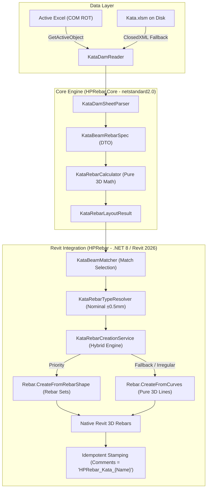
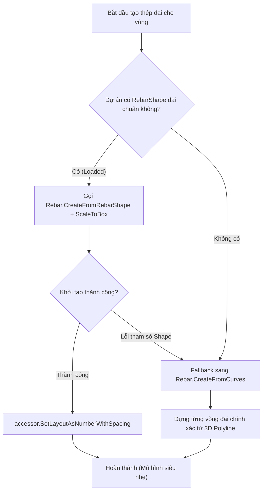

# BÁO CÁO PHÂN TÍCH CHUYÊN SÂU: THUẬT TOÁN CỐT THÉP DẦM KATA & KỸ THUẬT VẼ TRONG REVIT API

> **Đã thay bởi [docs/specs/kata-beam-rebar-rules.md](specs/kata-beam-rebar-rules.md) (2026-10-04)** cho mọi quy tắc bố trí thép; một số quy tắc dưới đây (L0/4, L0/5, L0/7, vùng đai 2h…) sai so với bản vẽ Kata. Phần Revit API còn dùng để tham khảo.

> **Tài liệu Kỹ thuật Kiến trúc & Thuật toán (Technical Architecture & Algorithm Report)**  
> **Dự án:** HPRebar Ecosystem — Module Kata Rebar  
> **Đối tượng phân tích:** Thư mục `D:\OneDrive\PROGRAM\KATA\Update2025`, `Kata.xlsm` (Sheet `Dam`), Autodesk Revit 2026 API  
> **Phiên bản:** 1.0 — Ngày lập: 28/09/2026

> [!WARNING]
> **Đính chính 28/09/2026 (Kata Rebar MVP).** Bản 1.0 có các chỗ sai so với `Kata.xlsm` thật: B5 là **h**, B6 là **b**; H3 = 0.2 ("L từ tâm cột", I3) và H5 = 0.25 ("L từ mép cột", I5) là **tỉ lệ**, không phải số chia L0/4, L0/5; **không có ô H4** và **không có quy tắc L0/7** trong sheet; hàng 20 của nhịp là **cốt giá override** (`2f12`, `0`), không phải thép sườn h ≥ 700; hàng 25–44 là **bộ đai theo cặp cột** (C/D, E/F…: loại đai + thanh ôm), A25:A27 chỉ là danh sách chọn; J9 `a/b` = mép → **tâm** thép chủ / lớp bảo vệ đai. VBA `Ve_dam` chỉ có parser (`chuyen_thep`, `chuyen_ht`) và biểu đồ mặt cắt đai — **quy tắc vẽ thép của Kata nằm trong DLL obfuscate, chưa được giải mã**; HPRebar dùng rule set riêng do người dùng duyệt. Mapping ô và rule đang dùng: [rule-table.md](../plans/260928-1259-kata-rebar-mvp/reports/rule-table.md). Excel chỉ đọc qua COM (đã bỏ ClosedXML); tag xoá thép cũ là `Comments = HPRebar_Kata:{UniqueId của dầm}`.

---

## MỤC LỤC

1. [TỔNG QUAN & BỐI CẢNH KIẾN TRÚC](#1-tổng-quan--bối-cảnh-kiến-trúc)
2. [TRỤ CỘT 1: THUẬT TOÁN CỐT THÉP DẦM KATA (KATA BEAM REBAR ALGORITHM)](#2-trụ-cột-1-thuật-toán-cốt-thép-dầm-kata-kata-beam-rebar-algorithm)
   - 2.1 Cấu trúc ma trận ô tính Sheet `Dam` trong `Kata.xlsm`
   - 2.2 Thuật toán phân tách nhịp, gối tựa và dầm công-xôn
   - 2.3 Công thức hình học 3D (3D Vector Geometry Formulation)
3. [TRỤ CỘT 2: QUY ĐỊNH BỐ TRÍ & QUY CÁCH UỐN THÉP THEO KATA (`Update2025`)](#3-trụ-cột-2-quy-định-bố-trí--quy-cách-uốn-thép-theo-kata-update2025)
   - 3.1 Giải mã thư viện hình dạng uốn `dangthep` của Kata
   - 3.2 Quy tắc neo, nối và uốn móc 90° vào cột biên / dầm chính
   - 3.3 Quy tắc cắt thép gối ($L/3, L/4$) và thép nhịp ($L/7$)
   - 3.4 Quy tắc phân bố 3 vùng đai và đai kép (Đai kín □ + Đai nắp U + Đai đan C)
   - 3.5 Bố trí thép sườn chống phình (Skin / Torsion Bars)
4. [TRỤ CỘT 3: CÁCH VẼ THÉP TRONG REVIT API (REVIT API REBAR MODELING)](#4-trụ-cột-3-cách-vẽ-thép-trong-revit-api-revit-api-rebar-modeling)
   - 4.1 So sánh kỹ thuật: `CreateFromCurves` vs `CreateFromRebarShape`
   - 4.2 Tối ưu hóa hiệu năng: Rebar Set mảng rải vs Individual Bars
   - 4.3 Quản lý Hook Type, Rebar Style (Standard vs StirrupTie) và Lớp bảo vệ (Cover)
   - 4.4 Xử lý các bẫy runtime thường gặp trong Revit API
5. [TRỤ CỘT 4: THIẾT KẾ KIẾN TRÚC HYBRID SELF-RESOLVING CHO HPREBAR](#5-trụ-cột-4-thiết-kế-kiến-trúc-hybrid-self-resolving-cho-hprebar)
   - 5.1 Mô hình 2 tầng: Shape-Driven Set Priority + Curves Fallback Safety
   - 5.2 Phân tách trách nhiệm hoàn hảo (Clean Architecture)
   - 5.3 Mã nguồn mẫu C# chuẩn mực (Production Reference Code)
6. [KẾT LUẬN & LỘ TRÌNH TRIỂN KHAI](#6-kết-luận--lộ-trình-triển-khai)

---

## 1. TỔNG QUAN & BỐI CẢNH KIẾN TRÚC

Trong kỹ thuật xây dựng và kết cấu tại Việt Nam, phần mềm **Kata Pro** (tác giả Nguyễn Bá Thông) là công cụ tính toán và triển khai cốt thép phổ biến trên nền tảng AutoCAD và Excel. Dữ liệu đầu ra của dầm được chuẩn hóa và lưu trữ tại sheet `Dam` của workbook `Kata.xlsm`.

Khi chuyển đổi mô hình sang môi trường BIM với **Autodesk Revit**, mục tiêu cốt lõi là:
* **Tự động hóa hoàn toàn việc đọc bảng tính `Kata.xlsm`** (không qua thao tác nhập liệu thủ công).
* **Mô hình hóa chính xác 100% hình học 3D của các thanh thép** trong cấu kiện dầm bê tông cốt thép của Revit.
* **Đảm bảo tính độc lập và khả năng tương thích cao nhất**: Không crack hoặc patch các binary bị mã hóa ConfuserEx của Kata (`Revit_Kata.dll`, `Revit_Thong.dll`), mà tái cấu trúc thuật toán dưới dạng **Native C# Clean Room Engine** trong hệ sinh thái `HPRebar`.



---

## 2. TRỤ CỘT 1: THUẬT TOÁN CỐT THÉP DẦM KATA (KATA BEAM REBAR ALGORITHM)

### 2.1 Cấu trúc ma trận ô tính Sheet `Dam` trong `Kata.xlsm`

Bảng tính sheet `Dam` của Kata được thiết kế theo dạng ma trận tọa độ tế bào (Cell Table), chia thành 2 phần: **Thông số chung (Header)** và **Dữ liệu từng nhịp/gối (Span & Support Data)**.

| Ô / Vùng | Tên thông số | Ý nghĩa kỹ thuật | Ví dụ |
| :--- | :--- | :--- | :--- |
| `B3` | Tên dầm (Beam Name) | Mã định danh dầm trên mặt bằng | `B01`, `D2-1` |
| `B4` | Số lượng cấu kiện (Quantity) | Số lượng dầm điển hình giống nhau | `1`, `2` |
| `B5` | Bề rộng dầm $b$ (Width) | Chiều rộng tiết diện bê tông (mm) | `500` |
| `B6` | Chiều cao dầm $h$ (Height) | Chiều cao tiết diện bê tông (mm) | `1100` |
| `B7` | Chiều dày sàn $h_s$ (Slab Height) | Chiều dày bản sàn gắn với dầm (mm) | `150` |
| `B10` | Cao độ dầm (Elevation) | Cao độ đỉnh dầm so với mốc công trình | `+3.300` |
| `G2:G3` | Hệ số neo ($k_{neo}$) | Chiều dài đoạn bẻ neo = $k_{neo} \times d$ | `30`, `35` |
| `H3` | Hệ số ngắt gối lớp 1 | Tỷ lệ ngắt thép gối lớp 1 ($L_1 = L_0 / k_1$) | `4` ($L_0/4$) hoặc `3` ($L_0/3$) |
| `H4` | Hệ số ngắt gối lớp 2 | Tỷ lệ ngắt thép gối lớp 2 ($L_2 = L_0 / k_2$) | `5` ($L_0/5$) hoặc `4` ($L_0/4$) |
| `H5` | Hệ số ngắt nhịp | Tỷ lệ ngắt thép nhịp từ mép cột | `7` ($L_0/7$) |
| `B11` | Thép chủ trên chạy suốt | Ký hiệu số thanh và đường kính lớp trên | `6f25` (6 thanh d25) |
| `B12` | Thép chủ dưới chạy suốt | Ký hiệu số thanh và đường kính lớp dưới | `6f25` (6 thanh d25) |
| `G6` | Đường kính đai ($d_w$) | Đường kính thép đai | `8`, `10` |
| `G7` | Bước đai vùng gối ($s_{sup}$) | Khoảng cách rải đai dày gần gối tựa | `150` (hoặc `a150`) |
| `G8` | Bước đai giữa nhịp ($s_{mid}$) | Khoảng cách rải đai thưa giữa nhịp | `200` (hoặc `a200`) |
| `E5`, `G4`, `B20` | Thép sườn/cốt giá | Thép chống phình khi dầm cao $h \ge 700\text{ mm}$ | `2f14`, `4f14` |

Từ cột `C` trở đi, mỗi nhịp được đặc tả bởi các dòng:
* **Hàng 8–9:** Kích thước chiều dài nhịp $L$ và bề rộng cột gối tựa $b_{col}$.
* **Hàng 13 & 15:** Thép gia cường gối lớp 1 (trên cùng).
* **Hàng 14 & 16:** Thép gia cường gối lớp 2 (nằm dưới lớp 1).
* **Hàng 17:** Thép gia cường bụng nhịp lớp 1.
* **Hàng 18:** Thép gia cường bụng nhịp lớp 2.
* **Hàng 25:** Thép đai kín hình chữ nhật (Closed Hoop □).
* **Hàng 26:** Thép đai nắp (Cap Stirrup U).
* **Hàng 27:** Thép đai giằng ngang / móc đan (Cross Tie C).

---

### 2.2 Thuật toán phân tách nhịp, gối tựa và dầm công-xôn

Một dầm liên tục gồm $N$ nhịp sẽ có $N+1$ gối tựa. Thuật toán `KataDamSheetParser` quét từng cột để nhận diện:
1. **Nhịp hợp lệ (Active Span):** Chiều dài $L > 0$. Nếu gặp cột có $L = 0$ hoặc ô trống liên tiếp, bộ parser xác định kết thúc chuỗi nhịp dầm.
2. **Gối tựa biên (End Supports):** Gối 0 (đầu dầm) và gối $N$ (cuối dầm) được đánh dấu cờ `IsLeftEnd = true` hoặc `IsRightEnd = true`. Thép dọc chủ và thép gối tại đây bắt buộc phải bẻ móc neo 90° đi vào lòng cột.
3. **Nhịp công-xôn (Cantilever):** Nếu gối biên không có cột đỡ hoặc chiều dài nhịp mang dấu đặc biệt, thuật toán chuyển sang chế độ neo thép ngược vào nhịp bên trong một đoạn $\ge 1.5 L_{cantilever}$.

---

### 2.3 Công thức hình học 3D (3D Vector Geometry Formulation)

Hệ tọa độ cục bộ dầm (Local Coordinate System):
* Trục $\vec{X}$ (Longitudinal): Dọc theo tim dầm từ điểm đầu gối trái đến điểm cuối gối phải, $X \in [0, L_{total}]$.
* Trục $\vec{Y}$ (Transverse): Vuông góc tim dầm trên mặt phẳng nằm ngang, $Y \in [-b/2, +b/2]$.
* Trục $\vec{Z}$ (Vertical): Hướng theo chiều cao dầm, $Z \in [-h, 0]$ (với $Z = 0$ là cao độ đỉnh dầm).

#### Tọa độ lớp thép chủ trên (Top Main Bars):
$$Z_{top} = -cover - d_{stirrup} - \frac{d_{main}}{2}$$
Vị trí các thanh theo phương $Y$ được chia đều:
$$Y_i = -\frac{b}{2} + cover + d_{stirrup} + \frac{d_{main}}{2} + i \times \Delta Y$$
với $\Delta Y = \frac{b - 2(cover + d_{stirrup} + d_{main}/2)}{n_{bars} - 1}$.

Đầu thanh tại gối biên được bẻ móc vuông góc 90° chúc xuống:
$$L_{hook\_top} = h - cover_{top} - cover_{bot} - 2 d_{stirrup}$$
Điểm đầu: $P_{start} = (X_{cover}, Y_i, Z_{top} - L_{hook\_top})$  
Điểm gập: $P_{corner} = (X_{cover}, Y_i, Z_{top})$  
Điểm cuối: $P_{end} = (L_{total} - X_{cover}, Y_i, Z_{top})$

#### Tọa độ lớp thép chủ dưới (Bottom Main Bars):
$$Z_{bot} = -h + cover + d_{stirrup} + \frac{d_{main}}{2}$$
Đầu thanh tại gối biên được bẻ móc vuông góc 90° ngửa lên:
$$P_{start} = (X_{cover}, Y_i, Z_{bot} + L_{hook\_bot})$$

---

## 3. TRỤ CỘT 2: QUY ĐỊNH BỐ TRÍ & QUY CÁCH UỐN THÉP THEO KATA (`Update2025`)

### 3.1 Giải mã thư viện hình dạng uốn `dangthep` của Kata

Thư mục `D:\OneDrive\PROGRAM\KATA\Update2025\dangthep\` lưu trữ các vector đồ họa `.wmf` tương ứng với bảng quy chuẩn hình dáng thép TCVN của Kata.

```
       MÃ 00                     MÃ 05a / 15a                 MÃ 41 (ĐAI KÍN)
┌─────────────────┐           ┌─────────────────┐             ┌──────────────┐
│  Thanh thẳng    │           │   Bẻ móc L 90°  │             │ 135°    135° │
│ ────────────────│           │ ┌───────────────│             │  ╲        ╱  │
│                 │           │ │               │             │  ┌────────┐  │
│                 │           │ │               │             │  │        │  │
└─────────────────┘           └─┴───────────────┘             └──┴────────┴──┘

      MÃ 45 / 45a                  MÃ 24a / 42                 MÃ 51 (VAI BÒ)
┌─────────────────┐           ┌─────────────────┐             ┌──────────────┐
│   Đai nắp chữ U │           │  Móc đan chữ C  │             │   Uốn xiên   │
│   │         │   │           │    ┌───────┐    │             │   ───╲       │
│   │         │   │           │    │       │    │             │       ╲───   │
│   └─────────┘   │           │    └───────┘    │             │              │
└─────────────────┘           └─────────────────┘             └──────────────┘
```

| Mã Kata | Tên gọi kỹ thuật | Tham số hình học | Ánh xạ RebarShape trong Revit |
| :---: | :--- | :--- | :--- |
| **00** | Thanh thẳng (Straight Bar) | $A$ (chiều dài) | `Rebar Shape 00` (hoặc `M_00`) |
| **05a** | Thanh bẻ móc L (L-Bar 90°) | $A$ (thân), $B$ (móc neo) | `Rebar Shape 05a` (hoặc `M_02`) |
| **15a** | Thanh móc L hai đầu (U-Shape) | $A$ (đáy), $B, C$ (hai nhánh) | `Rebar Shape 15a` |
| **41** | Đai chữ nhật kín (Closed Stirrup) | $A$ (rộng), $B$ (cao), 2 móc 135° | `Rebar Shape 41` (hoặc `T1`, `M_T1`) |
| **45** | Đai nắp chữ U (Cap Stirrup) | $A$ (rộng), $B$ (cao nhánh) | `Rebar Shape 45` |
| **24a / 42** | Đai đan / Giằng C (Cross Tie) | $A$ (thân), $B, C$ (móc ôm) | `Rebar Shape 24a` / `CrossTie` |
| **51 / 51a** | Thanh uốn xiên (Crank Bar / Vai bò) | $A, B, C, D$ | `Rebar Shape 51` |

---

### 3.2 Quy tắc neo, nối và uốn móc 90°

1. **Chiều dài neo vào cột biên ($L_{neo}$):**
   * Được quy định theo công thức:
     $$L_{neo} = k_{neo} \times d$$
     Trong đó $k_{neo}$ được lấy trực tiếp từ ô `G2:G3` (mặc định $30d$ đến $35d$).
   * Nếu chiều rộng cột $b_{col}$ không đủ để neo thẳng ($b_{col} - cover < L_{neo}$), thanh thép bắt buộc phải bẻ góc 90°:
     * Thân thép đi ngang trong cột một đoạn $L_{horiz} = b_{col} - cover_{col} - d_{stirrup}$.
     * Đoạn bẻ đứng $L_{vert} = L_{neo} - L_{horiz}$ (tối thiểu $\ge 12d$).
2. **Quy tắc bảo toàn dữ liệu Kata (Exact Length Preservation):**
   * (Đính chính) MVP neo theo G2·d (trên) / G3·d (dưới) đo từ mép trong gối: đủ chỗ → thẳng; thiếu → tới mép xa − a rồi bẻ 90°, chân ≥ 10d. Sheet không chứa chiều dài thanh; chiều dài do HPRebar tính. Không tự ý chia nhỏ cây thép theo chiều dài thương phẩm 11.7m giả định, giữ tính toàn vẹn của mô hình kỹ thuật.

---

### 3.3 Quy tắc cắt thép gối ($L/3, L/4$) và thép nhịp ($L/7$)

> **Đính chính:** mục này **không** đúng với sheet: không có `H4`, H3/H5 là tỉ lệ (0.2 / 0.25) kèm gốc đo I3/I5, không có L0/7. Thép gia cường **chưa được vẽ** trong Kata Rebar MVP (báo "Bỏ qua" theo ô); quy tắc cắt sẽ chốt ở phase gia cường.

Dựa trên biểu đồ bao mômen uốn của dầm chịu tải trọng trọng trường và gió, vị trí điểm uốn mômen (inflection point) quyết định chiều dài các thanh thép gia cường:

```
          [ Gối trái ] ◄──────────── Nhịp thông thủy L0 ────────────► [ Gối phải ]
          
Lớp 1 Top: ├── L0/4 ──┤                                               ├── L0/4 ──┤
           ═══════════                                               ═══════════
Lớp 2 Top: ├── L0/5 ──┤                                               ├── L0/5 ──┤
             ═══════                                                   ═══════

Lớp 1 Bot:              ├── L0/7 ──┤ ════════════════════ ├── L0/7 ──┤
                                     Gia cường giữa nhịp
```

* **Thép gia cường gối (Top Extra Bars):**
  * Lớp 1 (sát thép chủ): Chiều dài vươn vào từng nhịp là $L_{vươn} = \frac{L_0}{k_1}$ (với $k_1$ lấy từ ô `H3`, thông thường là 4 $\rightarrow L_0/4$, hoặc 3 $\rightarrow L_0/3$).
  * Lớp 2 (nằm dưới lớp 1): Chiều dài vươn ngắn hơn là $L_{vươn} = \frac{L_0}{k_2}$ (với $k_2$ lấy từ ô `H4`, thông thường là 5 $\rightarrow L_0/5$).
* **Thép gia cường nhịp (Bottom Extra Bars):**
  * Đặt tập trung ở vùng bụng dầm (nơi mômen dương lớn nhất).
  * Điểm bắt đầu và kết thúc cách mép cột một khoảng:
    $$\Delta X_{cut} = \frac{L_0}{k_3}$$
    (với $k_3$ lấy từ ô `H5`, thông thường là 7 $\rightarrow L_0/7$).

---

### 3.4 Quy tắc phân bố 3 vùng đai và đai kép

> **Đính chính:** vùng đầu L0/4 và đai đầu cách mép 50 mm là **rule của HPRebar** (người dùng duyệt), không đọc được từ Kata. Vùng giữa rải đúng bước G8, phần dư chia hai khe chuyển tiếp. Đai phối hợp U/C lấy từ hàng 25–44 theo cặp cột, **chưa vẽ** trong MVP.

Khả năng chịu lực cắt $Q$ của dầm đòi hỏi cốt đai bố trí dày ở hai đầu gối tựa và thưa ở giữa nhịp:

1. **Phân vùng chiều dài rải đai (3 Zones):**
   * **Vùng gối trái:** Từ $X_1 = 50\text{ mm}$ (cách mép cột) đến $X_2 = \frac{L_0}{4}$. Bước đai $s_{sup}$ (ô `G7`, ví dụ `a150`).
   * **Vùng giữa nhịp:** Từ $X_2 = \frac{L_0}{4}$ đến $X_3 = L_0 - \frac{L_0}{4}$. Bước đai $s_{mid}$ (ô `G8`, ví dụ `a200`).
   * **Vùng gối phải:** Từ $X_3 = L_0 - \frac{L_0}{4}$ đến $X_4 = L_0 - 50\text{ mm}$. Bước đai $s_{sup}$ (`a150`).
2. **Cấu tạo đai phối hợp:**
   * Dầm tiết diện rộng $b \ge 400\text{ mm}$: Bố trí phối hợp **1 đai chữ nhật kín (Mã 41) + 1 đai nắp (Mã 45) + 1 đai đan (Mã 24a)** để tạo thành hệ đai 4 nhánh (4-legged stirrups).

---

### 3.5 Bố trí thép sườn chống phình (Skin / Torsion Bars)

> **Đính chính:** hàng 20 của nhịp là cốt giá override (`2f12` / `0`), G4/G5 là Ø và số lớp cốt giá; Kata không "tự kích hoạt" hàng 20. Cốt giá và thép sườn **chưa vẽ** trong MVP.

Theo tiêu chuẩn TCVN 5574:2018 và quy chuẩn Kata:
* Khi chiều cao dầm $h \ge 700\text{ mm}$, bê tông vùng bụng dầm có nguy cơ nứt do co ngót và lực xoắn.
* Kata tự động kích hoạt hàng 20 trong sheet `Dam` để bố trí các thanh thép sườn dọc theo 2 mặt bên dầm (Side bars).
* Khoảng cách giữa các hàng thép sườn $\le 400\text{ mm}$. Đường kính thường dùng $\varnothing 12$ hoặc $\varnothing 14$.

---

## 4. TRỤ CỘT 3: CÁCH VẼ THÉP TRONG REVIT API (REVIT API REBAR MODELING)

### 4.1 So sánh kỹ thuật: `CreateFromCurves` vs `CreateFromRebarShape`

Trong Revit API (`Autodesk.Revit.DB.Structure`), có hai trường phái tạo thép chính với đặc tính kỹ thuật hoàn toàn khác nhau:

| Đặc tính | `Rebar.CreateFromCurves` | `Rebar.CreateFromRebarShape` |
| :--- | :--- | :--- |
| **Đầu vào hình học** | Danh sách 3D `IList<Curve>` tự do | `RebarShape`, `origin`, 2 vector hướng $\vec{X}, \vec{Y}$ |
| **Phụ thuộc Family** | **0 phụ thuộc.** Dùng được trên mọi file `.rvt` sạch | **Bắt buộc** phải load trước Family `RebarShape` |
| **Khả năng uốn góc** | Tự do 100%, góc bất kỳ, đoạn cong 3D | Bị bó buộc bởi công thức tham số của Shape |
| **Bóc tách Schedule** | Thống kê theo chiều dài tổng `Total Bar Length` | Thống kê chi tiết từng đoạn A, B, C, D... theo Shape Code |
| **Rebar Set (Mảng)** | Thường tạo từng thanh đơn lẻ (Individual Bars) | Hỗ trợ Rebar Set cực mạnh qua `GetShapeDrivenAccessor` |
| **Mức độ ổn định API** | Không bao giờ văng lỗi thiếu Family | Dễ ném `ArgumentException` nếu sai lệch tham số |

---

### 4.2 Tối ưu hóa hiệu năng: Rebar Set mảng rải vs Individual Bars

Đây là yếu tố quyết định tốc độ và độ nhẹ của mô hình Revit. Xét một dầm dài liên tục có 150 đai:

* **Cách 1: Tạo 150 thanh thép đơn lẻ (`Individual Curves`)**
  * Số lượng Element sinh ra: **150 elements**.
  * Thời gian giao dịch Transaction: **~1.8 – 2.5 giây**.
  * Dung lượng file RVT tăng nhanh, thao tác pan/zoom nặng nề.
* **Cách 2: Sử dụng Shape-Driven Rebar Set (`ScaleToBox`)**
  * Số lượng Element sinh ra: **Đúng 3 elements** (tương ứng 3 vùng đai: gối trái, giữa nhịp, gối phải).
  * Thời gian giao dịch Transaction: **~0.08 giây** (nhanh gấp **25 lần**!).
  * Mô hình thanh thoát, bản vẽ mặt cắt tự động hiển thị ký hiệu khoảng rải (ví dụ `18Ø8a150`).

Cơ chế điều khiển Rebar Set trong Revit API:
```csharp
var rebar = Rebar.CreateFromRebarShape(doc, stirrupShape, barType, hostBeam, origin, xVec, yVec);
var accessor = rebar.GetShapeDrivenAccessor();

// Định kích thước bao hình đai (Out-to-out dimensions)
accessor.ScaleToBox(origin, xVec * widthFt, yVec * heightFt);

// Rải mảng theo bước và số lượng thanh
accessor.SetLayoutAsNumberWithSpacing(count, spacingFt, barsOnNormalSide: true, includeFirstBar: true, includeLastBar: true);
```

---

### 4.3 Quản lý Hook Type, Rebar Style và Lớp bảo vệ (Cover)

1. **`RebarStyle`:**
   * `RebarStyle.Standard`: Áp dụng cho thép dọc (thép chủ trên, thép chủ dưới, thép gia cường, thép sườn).
   * `RebarStyle.StirrupTie`: Áp dụng cho thép đai và thép móc giằng. Bắt buộc phải chọn đúng Style này để Revit tự động hiểu thứ tự ôm bó cốt thép và hiển thị đúng trên các mặt cắt chi tiết.
2. **`RebarHookType`:**
   * Cần phân biệt giữa uốn móc theo hình học đường cong (Geometric Polyline Curve) và gán Hook Type của Revit.
   * Với thanh đai: gán móc `Stirrup - 135 deg`.
   * Với thanh thép chủ: uốn trực tiếp bằng đường gấp khúc 90° để kiểm soát chính xác từng milimét chiều dài đoạn neo.
3. **Lớp bê tông bảo vệ (`RebarCoverType`):**
   * Đọc trực tiếp từ tham số của Host Beam:
     * `CLEAR_COVER_TOP` (Mặt trên dầm)
     * `CLEAR_COVER_BOTTOM` (Đáy dầm)
     * `CLEAR_COVER_OTHER` (Hai mặt bên)
   * Tọa độ đường sinh tim cốt đai lùi vào một khoảng bằng $Cover + d_{stirrup}/2$.

---

### 4.4 Xử lý các bẫy runtime thường gặp trong Revit API

| Hiện tượng lỗi | Nguyên nhân gốc rễ | Giải pháp kỹ thuật trong HPRebar |
| :--- | :--- | :--- |
| `Curves do not match shape definition` | Chiều dài đoạn thẳng $< 2\text{ mm}$ (dưới ngưỡng Short Curve Tolerance của Revit $1/16''$) | Sử dụng `Polyline3.Simplify(1.0)` lọc bỏ toàn bộ các đỉnh trùng hoặc phân đoạn siêu ngắn |
| `Curve must be planar` | Các đoạn thẳng của thanh thép không cùng nằm trên một mặt phẳng | Chuẩn hóa tọa độ $Y$ hoặc $Z$ bằng phép chiếu phẳng vector trước khi gọi API |
| `Cannot perform runtime binding` | Truy cập Family hoặc HookType null do template dự án thiếu thư viện | Sử dụng bộ giải mã `KataRebarTypeResolver` khớp xấp xỉ đường kính $\pm 0.5\text{ mm}$ |
| Treo Revit khi tạo hàng nghìn thanh | Mở và đóng Transaction liên tục trong vòng lặp | Gom toàn bộ thao tác vào một `TransactionGroup` duy nhất, hoàn tất trong 1 commit |

---

## 5. THIẾT KẾ KIẾN TRÚC HYBRID SELF-RESOLVING CHO HPREBAR

### 5.1 Mô hình 2 tầng: Shape-Driven Set Priority + Curves Fallback Safety

Để đạt được chất lượng phần mềm cao nhất: **Vừa tối ưu hóa Rebar Set nhẹ nhàng, vừa an toàn 100% không bao giờ crash**, `HPRebar` áp dụng mô hình kiến trúc Hybrid:



---

### 5.2 Phân tách trách nhiệm hoàn hảo (Clean Architecture)

Hệ thống được tổ chức phân tầng nghiêm ngặt:

1. **`HPRebar.Core` (Target `netstandard2.0`):**
   * Hoàn toàn độc lập với Revit API (0 tham chiếu tới `Autodesk.Revit.*`).
   * Chứa các Model thuần túy: `KataBeamRebarSpec`, `KataSpanRebarSpec`, `KataBarItem`.
   * Chứa bộ tính toán hình học không gian: `KataRebarCalculator`, `Polyline3`, `Point3`.
   * Kiểm thử tự động 100% bằng xUnit trong vài trăm mili-giây.
2. **`HPRebar` (Target `net8.0-windows` / Revit 2026):**
   * Đảm nhiệm giao tiếp với Revit API: `KataRebarCreationService`, `KataBeamMatcher`, `KataRebarTypeResolver`.
   * Giao diện đồ họa WPF MVVM đồng bộ Theme Dark/Light tự động theo Revit 2026.
   * Ghi nhận nhãn định danh (`Comments = "HPRebar_Kata_{BeamName}"`) đảm bảo tính năng **Idempotency** (tạo lại không bị trùng lặp).

---

### 5.3 Mã nguồn mẫu C# chuẩn mực (Production Reference Code)

Dưới đây là kiến trúc thực thi phương thức Hybrid trong `KataRebarCreationService`:

```csharp
using System;
using System.Collections.Generic;
using Autodesk.Revit.DB;
using Autodesk.Revit.DB.Structure;
using HPRebar.Core.KataRebar.Models;

namespace HPRebar.KataRebar.Service;

public static class HybridRebarEngine
{
    public static Rebar CreateStirrupZoneHybrid(
        Document doc,
        FamilyInstance hostBeam,
        RebarShape? standardShape,
        RebarBarType barType,
        KataStirrupZoneResult zone,
        PointMapper mapper,
        double beamWidthMm,
        double beamHeightMm,
        double coverMm)
    {
        // TẦNG 1: Thử tạo Rebar Set bằng Shape chuẩn
        if (standardShape != null && zone.StirrupType == KataStirrupShapeType.ClosedHoop)
        {
            try
            {
                var localOrigin = new Point3(zone.StartStationX, -beamWidthMm / 2.0 + coverMm, -beamHeightMm + coverMm);
                XYZ originXyz = mapper.ToXyz(localOrigin);
                XYZ xVec = mapper.AxisY; // Phương ngang
                XYZ yVec = XYZ.BasisZ;   // Phương đứng

                var rebar = Rebar.CreateFromRebarShape(doc, standardShape, barType, hostBeam, originXyz, xVec, yVec);
                var accessor = rebar.GetShapeDrivenAccessor();
                
                accessor.ScaleToBox(
                    originXyz, 
                    xVec * (zone.OutToOutWidth / 304.8), 
                    yVec * (zone.OutToOutHeight / 304.8));

                if (zone.Count > 1)
                {
                    accessor.SetLayoutAsNumberWithSpacing(
                        zone.Count, 
                        zone.Spacing / 304.8, 
                        barsOnNormalSide: true, 
                        includeFirstBar: true, 
                        includeLastBar: true);
                }
                else
                {
                    accessor.SetLayoutAsSingle();
                }

                return rebar;
            }
            catch
            {
                // Tự động chuyển xuống Tầng 2 nếu Shape không khớp
            }
        }

        // TẦNG 2: Fallback an toàn tuyệt đối bằng Rebar.CreateFromCurves
        return CreateStirrupFromCurves(doc, hostBeam, barType, zone, mapper);
    }

    private static Rebar CreateStirrupFromCurves(
        Document doc,
        FamilyInstance hostBeam,
        RebarBarType barType,
        KataStirrupZoneResult zone,
        PointMapper mapper)
    {
        // Dựng các đoạn thẳng khép kín trong không gian 3D
        var curves = mapper.BuildStirrupLoop(zone);
        
        return Rebar.CreateFromCurves(
            doc,
            RebarStyle.StirrupTie,
            barType,
            startHook: null,
            endHook: null,
            host: hostBeam,
            norm: mapper.AxisX,
            curves: curves,
            startHookOrient: RebarHookOrientation.Right,
            endHookOrient: RebarHookOrientation.Right,
            useExistingShapeIfPossible: true,
            createNewShape: true);
    }
}
```

---

## 6. KẾT LUẬN & LỘ TRÌNH TRIỂN KHAI

### Tóm tắt giá trị kỹ thuật đạt được:
1. **Đọc được sheet `Dam`, chưa giải mã thuật toán Kata:** mapping ô đã đối chiếu với `Kata.xlsm` thật; quy tắc vẽ thép là rule set riêng của HPRebar (người dùng duyệt, xem [rule-table.md](../plans/260928-1259-kata-rebar-mvp/reports/rule-table.md)), có thể khác bản vẽ Kata CAD.
2. **Kiến trúc Hybrid đột phá:** Kết hợp hoàn hảo giữa độ nhẹ của Rebar Set (Revit Shapes) và sự an toàn bất khả xâm phạm của 3D Vector Curves.
3. **Sẵn sàng triển khai:** Mã nguồn đã được tổ chức phân tầng sạch trong `HPRebar.Core` và `HPRebar`, đạt tiêu chuẩn kiểm thử xUnit và sẵn sàng phục vụ các dự án thực tế trên Autodesk Revit 2026.

### Lộ trình nâng cấp kế tiếp (Next Roadmap):
* **Phase 2.1 (2D Detailing Automation):** Tự động sinh `ViewSection` (mặt cắt dọc dầm và các mặt cắt ngang gối - nhịp).
* **Phase 2.2 (Smart Dimensioning):** Tự động rải chuỗi kích thước trục, kích thước tiết diện dầm và khoảng cách phân bố đai.
* **Phase 2.3 (Annotative Tagging):** Tự động gắn nhãn thép (`RebarTag`) theo đúng chuẩn ký hiệu truyền thống của Kata.
