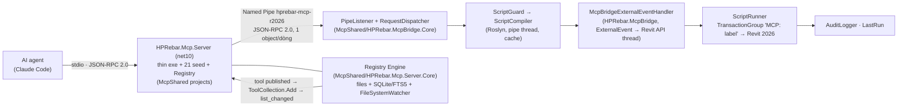

# System Architecture — Revit Add-In (Nice3point Stack)

> **Phần 1–N dưới đây mô tả cấu trúc *mặc định* của template Nice3point (`dotnet new revit-addin`, DI mode `container`).
> Đó KHÔNG phải cấu trúc thật của HPRebar** — HPRebar chưa nối DI container, và tên file trong sơ đồ
> (`MyAddIn`, `WallReportView`) chỉ là ví dụ của template. Xem **mục cuối — "Column Rebar (thực tế)"** cho
> kiến trúc đang chạy, và `docs/codebase-summary.md` cho bản đồ file đầy đủ.

## 1. High-Level Diagram

```
┌──────────────────────────────────────────────────────────────────┐
│                       Revit Process                              │
│  ┌────────────────────────────────────────────────────────────┐  │
│  │              Add-In: MyAddIn.dll (loaded by Revit)         │  │
│  │                                                            │  │
│  │  ┌──────────────────┐                                      │  │
│  │  │  Application.cs  │  ← Kế thừa ExternalApplication       │  │
│  │  │  OnStartupAsync()│    1. Setup Serilog                  │  │
│  │  │                  │    2. Build DI container             │  │
│  │  │                  │    3. CreateRibbon()                 │  │
│  │  └────┬─────────────┘                                      │  │
│  │       │                                                    │  │
│  │       ↓ (User click button)                                │  │
│  │  ┌────────────────────────────┐                            │  │
│  │  │  StartupCommand.cs         │  ← ExternalCommand         │  │
│  │  │  Execute()                 │    [Transaction(Manual)]   │  │
│  │  │  ├─ Resolve View qua DI    │                            │  │
│  │  │  └─ view.ShowDialog()      │                            │  │
│  │  └────┬───────────────────────┘                            │  │
│  │       │                                                    │  │
│  │       ↓                                                    │  │
│  │  ┌────────────────────────────────────────────────┐        │  │
│  │  │  Views/WallReportView.xaml                     │        │  │
│  │  │  ├─ Merge Theme.xaml (Dark + Light)            │        │  │
│  │  │  ├─ DataContext = ViewModel (DI inject)        │        │  │
│  │  │  └─ Bind {DynamicResource Brush.X}             │        │  │
│  │  └────┬───────────────────────────────────────────┘        │  │
│  │       │                                                    │  │
│  │       ↓                                                    │  │
│  │  ┌────────────────────────────────────────────────┐        │  │
│  │  │  ViewModels/WallReportViewModel.cs             │        │  │
│  │  │  sealed partial class : ObservableObject       │        │  │
│  │  │  ├─ [ObservableProperty] string _searchText    │        │  │
│  │  │  ├─ [RelayCommand] async Task RunAsync(token)  │        │  │
│  │  │  └─ ctor inject ILogger<T> + IWallService      │        │  │
│  │  └────┬───────────────────────────────────────────┘        │  │
│  │       │                                                    │  │
│  │       ↓                                                    │  │
│  │  ┌────────────────────────────────────────────────┐        │  │
│  │  │  Services/WallService.cs                       │        │  │
│  │  │  ├─ Truy cập Revit API (FilteredElementCollector)│       │  │
│  │  │  └─ Wrap Transaction nếu modify document       │        │  │
│  │  └────────────────────────────────────────────────┘        │  │
│  └────────────────────────────────────────────────────────────┘  │
└──────────────────────────────────────────────────────────────────┘
```

## 2. Folder Structure (Standard)

```
MyAddIn/
├── Application.cs                      ← Entry point (Revit gọi đầu tiên)
├── MyAddIn.csproj                      ← Nice3point.Revit.Sdk + config
├── MyAddIn.addin                       ← Revit manifest XML
├── launchSettings.json                 ← F5 → Revit.exe path
│
├── Commands/                           ← External Commands (button handlers)
│   ├── StartupCommand.cs
│   └── ExportReportCommand.cs
│
├── Configuration/                      ← DI + Logger setup
│   ├── HostingConfiguration.cs         ← services.Add... registration
│   └── LoggerConfiguration.cs          ← Serilog setup
│
├── ViewModels/                         ← MVVM ViewModels (CommunityToolkit.Mvvm)
│   ├── WallReportViewModel.cs
│   └── SettingsViewModel.cs
│
├── Views/                              ← WPF Views (XAML + minimal code-behind)
│   ├── WallReportView.xaml
│   ├── WallReportView.xaml.cs
│   ├── SettingsView.xaml
│   └── SettingsView.xaml.cs
│
├── Models/                             ← POCO / DTO (no Revit dep, test-friendly)
│   ├── WallInfo.cs
│   └── ReportSettings.cs
│
├── Services/                           ← Business logic
│   ├── IWallService.cs                 ← Interface (for DI + testing)
│   ├── WallService.cs                  ← Revit API access
│   └── ReportExporter.cs               ← Xuất Excel/PDF (qua document-skills)
│
├── Helpers/                            ← Multi-version compat shims
│   ├── ElementIdHelper.cs
│   └── UnitConverter.cs
│
└── Resources/
    ├── Icons/
    │   └── RibbonIcons.cs              ← Vector ribbon glyphs (DrawingImage, theme-aware); linked into HPRebar.McpBridge
    └── Themes/
        ├── Theme.xaml                  ← Master ResourceDictionary
        ├── ThemeDark.xaml              ← Dark color palette
        ├── ThemeLight.xaml             ← Light color palette
        ├── Typography.xaml             ← Font tokens
        ├── Spacing.xaml                ← Thickness tokens
        ├── Buttons.xaml                ← Button styles
        ├── TextBoxes.xaml              ← TextBox styles
        └── Controls.xaml               ← Card, Separator, Badge
```

## 3. DI Container (mode `container`)

`Configuration/HostingConfiguration.cs`:

```csharp
public static class HostingConfiguration
{
    private static IServiceProvider? _provider;

    public static IServiceProvider Provider => _provider
        ?? throw new InvalidOperationException("DI container not initialized");

    public static void Setup()
    {
        var services = new ServiceCollection();

        // Logging
        services.AddLogging(b => b.AddSerilog());

        // Services (singleton stateless, transient stateful)
        services.AddSingleton<IWallService, WallService>();
        services.AddSingleton<IThemeService, ThemeService>();
        services.AddTransient<IReportExporter, ReportExporter>();

        // ViewModels (transient — new instance per dialog open)
        services.AddTransient<WallReportViewModel>();
        services.AddTransient<SettingsViewModel>();

        // Views (transient — inject ViewModel via constructor)
        services.AddTransient<WallReportView>();
        services.AddTransient<SettingsView>();

        _provider = services.BuildServiceProvider();
    }
}
```

## 4. Multi-version Strategy (Revit 2022–2027)

`.csproj` configs:
```xml
<Configurations>Debug.R22;Debug.R23;Debug.R24;Debug.R25;Debug.R26;Debug.R27</Configurations>
<Configurations>$(Configurations);Release.R22;Release.R23;Release.R24;Release.R25;Release.R26;Release.R27</Configurations>
```

Target framework auto-switch:
- R22–R24 → `net48`
- R25–R27 → `net8.0-windows`

Code branching:
```csharp
#if REVIT2024_OR_GREATER
    long id = elementId.Value;
#else
    int id = elementId.IntegerValue;
#endif
```

Chi tiết: `.claude/skills/revit-addin/references/multi-version-strategy.md`.

## 5. Modal vs Modeless

| Pattern | When | Implementation |
|---|---|---|
| Modal | Dialog ngắn (< 30s), block Revit UI | `view.ShowDialog()` + set `Owner = UiApplication.MainWindowHandle` |
| Modeless | Panel/picker, user vẫn tương tác Revit | `view.Show()` + `ExternalEvent.Create(handler)` cho Revit API call |

## 6. Theme Switch Runtime

`Services/ThemeService.cs` swap MergedDictionary:
```csharp
var uri = theme == AppTheme.Dark
    ? new Uri("pabs://application:,,,/MyAddIn;component/Resources/Themes/ThemeDark.xaml")
    : new Uri("pabs://application:,,,/MyAddIn;component/Resources/Themes/ThemeLight.xaml");
// Replace dict trong Application.Current.Resources.MergedDictionaries
```

Mọi binding `{DynamicResource Brush.X}` tự refresh khi swap.

## 7. Deploy Pipeline

| Stage | Tool | Output |
|---|---|---|
| Build Debug | `dotnet build -c Debug.R<XX>` (F5) | DLL auto-deploy vào `%ProgramData%\Autodesk\Revit\Addins\<version>\` |
| Build Release | `dotnet build -c Release.R<XX>` | DLL trong `bin/Release.R<XX>/` |
| ILRepack | Auto khi `<IsRepackable>true</IsRepackable>` | Single merged DLL |
| Installer | `revit-solution` template (WixSharp) | `.msi` |
| Autodesk Store | `revit-solution` template | Bundle folder + PackageContents.xml |

## 8. Logging Flow

```
Revit event / User click button
        ↓
Command.Execute() → Log.Information("...")
        ↓
ViewModel logic → _logger.LogDebug(...)
        ↓
Service Revit API → _logger.LogInformation(...)
        ↓
Serilog File sink
        ↓
%LocalAppData%\MyAddIn\logs\addin-YYYY-MM-DD.log
```

Setup: `Configuration/LoggerConfiguration.cs` (Nice3point template sinh sẵn).

## 9. Stack Reference

| Component | Version | Source |
|---|---|---|
| .NET SDK | 8.0+ | https://dotnet.microsoft.com |
| Nice3point.Revit.Sdk | latest | NuGet |
| Nice3point.Revit.Toolkit | `$(RevitVersion).*` | NuGet |
| CommunityToolkit.Mvvm | 8.4+ | NuGet |
| Serilog | 4.3+ | NuGet |
| Microsoft.Extensions.DependencyInjection | latest stable | NuGet |
| TUnit (test) | latest | NuGet (Nice3point `revit-test` template) |
| xUnit (pure logic) | latest | NuGet |

## 10. Skill / Tool Map

| Khi cần | Skill |
|---|---|
| Scaffold mới | `/bs:revit-addin` |
| Sửa ViewModel/View | `/bs:revit-wpf-mvvm` |
| Sửa XAML style | `/bs:revit-xaml-styles` |

---

# MCP Bridge Architecture — Multi-Host Support

The `McpShared/` engine supports five verified MCP hosts: Revit 2026, AutoCAD 2026, Navisworks Manage 2026, Civil 3D 2026 (an AutoCAD vertical on the same `acad.exe`: `HPCivil3d/` is the AutoCAD bridge copied with Civil tokens plus the Civil API, bundle `Platform="Civil3D"`, pipe `hpcivil3d-mcp-2026`, `civil` global, units from the Civil drawing settings, `Rebuild*` denied; drift fenced by a mirror test — plan `plans/260917-1633-civil3d-mcp-2026/` complete 2026-09-18, 3 × 76 + 80 live checks) and ETABS 22 (out-of-process COM through the managed `ETABSv1.dll` wrapper; the bridge is a standalone WPF app `HPEtabs.McpBridge.exe` holding one STA COM attachment, the pipe `hpetabs-mcp-22` and two opt-in checkboxes; ETABS has no transaction, so scripts are tiered R/W/D from a generated allow-list bound semantically, W/D runs save the model and copy a `.EDB` snapshot first, and the destructive tier needs a second opt-in — plan `plans/260916-2152-etabs-mcp-2026/` complete 2026-09-17, 3 × 102 live checks). All hosts share the same engine constants, profiles, and DTO contracts via `HPRebar.Mcp.Contracts`, pipe routing via method suffix (`revit.execute` ≡ `autocad.execute` ≡ `navis.execute` ≡ `etabs.execute` ≡ `civil3d.execute`), and the registry system. Phase 0 (2026-09-16) introduced the ETABS engine constants (`PipeNaming.EtabsHost`, `GuardProfile.Etabs`, `ContextResult.Etabs` with `EtabsInfo`, `HostScriptContracts.EtabsImports/Globals`, `IHostProfile` hints); phases 1–4 (2026-09-17) built `HPEtabs/` — bridge app, server, 12 seeds, live harness — and closed a `#r`/`#load` guard bypass in the engine for every host.

# AutoCAD MCP Bridge — Server Architecture (Phases 1–4, 2026-09-14)

## Diagram — Stdio Server to Bridge

```
Host AI (Claude Code)
    ↓ stdio, JSON-RPC 2.0
HPAutoCad.Mcp.Server (net10 console)
    ├─ AutocadHostProfile (24 tools: 4 core + 8 registry + 12 seeds, resources, prompts)
    ├─ ExecuteCodeService (Roslyn guard → compile)
    └─ BridgeClient ──named pipe hpautocad-mcp-2026──→ HPAutoCad.McpBridge (inside acad.exe)
                                                           ├─ MainThreadQueue (ConcurrentQueue)
                                                           ├─ Application.Idle wake (PostMessage WM_NULL)
                                                           ├─ AutocadScriptRunner (outer TransactionGroup, inner tr)
                                                           ├─ DatabaseChangeCounter (HANDSEED + ObjectOpenedForModify)
                                                           ├─ AutocadContextReader (units mm, handles, layers, blocks)
                                                           ├─ AutocadResultSerializer (Entity, ObjectId, Point3d shapes)
                                                           └─ XAML status window (opt-in, OFF on load, never persisted)
```

## ContextService.Shape — Per-Host Shaping

`HPRebar.Mcp.Server.Core/Services/ContextService.cs` serializes context differently per host:

| Host | Output | Notes |
|---|---|---|
| Revit | Original object path | `revitVersion`, `isFamily`, full set; regression-tested byte-identical |
| AutoCAD | JsonObject via `SerializeToNode` | Drops `revitVersion` + `isFamily` (Revit-only semantics); preserves `hostVersion`, `isModifiable` (per-host docs in XML) |

The `Shape` method (`.cs:54-72`) checks `HostId == revit`, returning verbatim for Revit (no extra serialization cost), or filtering for non-Revit to hide Revit-specific fields.

## Ribbon Tab "HPAutoCad" (id=HPAUTOCAD_MCP_TAB) — Unified Loader UI Entry

```
HPAutoCad.Loader (Default ALC) → Ribbon tab "HPAutoCad" (id=HPAUTOCAD_MCP_TAB)
  ├─ panel "MCP" (id=HPAUTOCAD_MCP_PANEL)
  │    └─ [MCP Bridge] ──BridgeActions.Run("show")──→ Bridge Status Window (BridgeLoadContext)
  │         (vector icon: window + plug, ink per COLORTHEME, accent #0696D7)
  │
  └─ panel "HPGeoLink" (id=HPGEOLINK_PANEL)
       ├─ [KMZ] ──HPGeoDialogCommand──→ Geodetic Export Dialog (AppLoadContext / WebView2)
       └─ SplitButton:
            ├─ [-HPGEOKMZ] ──HPGeoKmzScriptCommand (CLI Export)
            ├─ [HPGEOIMPORT] ──HPGeoImportCommand (Import Dialog)
            └─ [HPGEOINFO] ──HPGeoInfoCommand (Coordinate Diagnostic)
```

The unified bundle `HPAutoCad.bundle` establishes a single Ribbon tab `HPAUTOCAD_MCP_TAB` housing both the AI MCP Bridge panel and the geodetic HPGeoLink UI panel. The tab survives AutoCAD workspace switches (`WSCURRENT`), theme flips (`COLORTHEME`), and is created idempotently without modifying CUIx.

## AEC Engine — `HPAutoCad.Aec` (plan 260916-1140, phases A–D 2026-09-16)

Phase B adds `Classification/` (rule-driven AEC types, `AecClassifier`) and `Relationships/` (`RelationshipDetector`); phase C adds the write side: `Model/EditResult` (edit envelope), `Cad/EditContext` (layer guard, space, points, properties), `EntityFactory` / `EntityUpdater` / `BatchEditService` (atomic = validate all, refuse on one invalid item, throw on a write failure so the bridge aborts), `BlockService`, `AnnotationService`, `HatchService`, `XrefService`, facade `AecTools.Editing`. Write seeds are `transaction: auto`; `dryRun` on the request rolls the bridge's transaction back. Read ops under a write tool return the analysis envelope, write ops the edit envelope. Phase D adds QA/QC: `Standards/` (rule set JSON + a pure checker over records and drawing tables), the shared `Issues/AuditIssue` with a stable severity order, `Cad/AuditService` (one query, several sections, ids kept) and `Cad/IssueMarkupService` (markers + leaders on a markup layer, two-phase). Phase E adds structural understanding: `Structural/` (members with sections/axes/marks, grid topology, connectivity / alignment / opening checks, tagging and schedules — pure, unit-tested), `Cad/StructuralService` (one classification pass + mark ownership) and `Cad/StructuralWriteService` (two-phase tags: attribute, in-place text or new text; ACAD_TABLE schedule); every structural tool pages under the 64 KB cap (`MaxGridLimit`, `MaxMemberLimit`, `MaxIssueLimit`) and the write tool caps its members (`MaxTagMembers`). Phase F adds rooms: `Architecture/` (the wall graph — pieces cut, gaps closed, doorways bridged, faces walked — room labels by caller patterns, boundary checks, the area schedule, dimension rules as data) behind `Cad/RoomService` (one classification pass narrowed to wall/room layers) and `Cad/RoomWriteService` (two-phase tags and dimensions); every `arch_*` tool shares one `detection` block so room ids agree across calls. Phase G adds the MEP graph: `Mep/` (runs and nodes, joined / tee / node connections, inline nodes, systems that never merge through a node, duplicates by projection, connectivity checks) behind `Cad/MepService` (one or two classification passes over the rule set's MEP layers and fitting block names) — read-only, paged under the cap. Phase H adds coordination: `Coordination/` (`ClashClassifier` — a meeting is a `hard_clash` only when an MEP element interpenetrates a member or another service's run, a `contact` when boundaries merely meet, an `area_overlap` inside a room or slab; `ClashDetector` over two classified sets within one space; `OpeningPlanner` — passes through host lines by side change and through outlines by the stretch inside, capped by `maxChordMm`) behind `Cad/CoordinationService` (a set = filter + AEC types) and `Cad/OpeningWriteService` (two-phase rectangle + MLeader requests on `HP-MCP-OPENINGS`). Phase I adds change sets: every write tool called with `changeSetId` records its call into a per-drawing ledger (`ChangeSets/ChangeSetLedger`, in the bridge process, keyed by the native database) instead of applying it; `commit_change_set` replays the calls through `Cad/ChangeSetReplay` in one run while `Cad/ChangeSetSnapshots` clones every entity opened for write, `rollback_change_set` undoes by handle (erase / un-erase / `CopyFrom`), and `UndoRule` notices a commit or rollback the bridge's dryRun (or `U`) undid.

### Phase A

```
seed code.cs (args → one AecTools call → envelope)
   └─▶ HPAutoCad.Aec.AecTools ──▶ Cad/ adapters (EntityQueryService, EntityShapeReader, MeasureService, SpatialQueryService, DrawingContextReader)
                                     └─▶ pure engine: Geometry/ (Pt, Box, Seg, PlanShape, GeometryTolerance, GeometryMath) · Spatial/ (SpatialIndex, SpatialPredicates) · Issues/ (GeometryIssueDetector)
       AutoCAD API only inside Cad/: SelectionFilter broad phase, GeometricExtents, Curve maths (length, area, GetClosestPointTo, IntersectWith), GetArcSegmentAt/GetSamplePoints
```

Tools stay seeds (ADR-01): the registry validates/lists/quarantines them like every other tool, `transaction: none` makes them read-only, and the
logic is compiled C# the bridge references (`BridgeEntry.CompilerReferences` += Aec, `HostScriptContracts.AutocadImports` += `HPAutoCad.Aec`).
Contracts (ADR-02): mm at the boundary via `units`; `GeometryTolerance` (pointEquality 0.5, endpointConnection 10, collinearity 1, parallelAngle 0.5°,
duplicate 1, tinySegment 5, roomGap 25) overridable per call; handles only; envelopes `{success, summary, items, count, offset, truncated, warnings, errors}`;
`ToolErrorCode` codes; `ArgumentException` for input that makes a run meaningless. Phase A tools: `get_drawing_context`, `query_entities`,
`query_entities_spatial`, `measure_geometry`, `detect_geometry_issues`. Verified live 2026-09-16: `run-aec-tools-live.ps1` 33/33.

## Phases 4–5 + Ribbon Status

| Phase | Work | Status |
|---|---|---|
| 4 ✅ | 12 embedded AutoCAD seed tools (6 read-only + 6 auto-transaction, 7 categories); registry per host profile (categories, reserved names, host stamp, CLI exe name); engine meta-tool descriptions host-neutral (8 tools); `ToolValidator`, `ToolLifecycleService` profile-driven; `SeedLibraryTests` 58 compile-checks; live 22/22 harness all seeds | Completed 2026-09-14 |
| 5 ✅ | Live verification harness (one stdio session, 65 scenarios, isolated registry, automate busy → ESC → retry); stability window fixes (arg errors excluded, window restarts at lifecycle event, restored tool not re-quarantined); two live-found defects fixed (seed quarantined by own tests, restored tool re-quarantined); runs 263 total (96 + 109 + 58), live 64 pass + 1 skip + isolation 4/4 + regression 21/21 | Completed 2026-09-14 |
| 6 ✅ | Ribbon tab: 2026-09-14 "MCP AutoCAD" (3 panels, 9 buttons + live label, bundle 0.2.0, live 8/8) → 2026-09-16 reduced to the Revit-style `HPAutoCad` ▸ `MCP` ▸ `MCP Bridge` (bundle 0.3.0, vector icon per theme, ribbon-only entry points removed; live 12/12 + icon MANUAL, bridge 21/21, smoke 22/22) | Completed 2026-09-16 |
| Debug F5 / runtime issue | `/bs:revit-debug` |
| Setup / chạy test | `/bs:revit-test` |
| Plan feature mới | `/bs:plan` (Stack-Aware 6-phase) |
| Implement plan | `/bs:cook` (build verify gate) |


---

# Column Rebar — kiến trúc thực tế

Cập nhật 2026-09-04. Đây là feature duy nhất hiện có, và là bản mẫu cho convention feature-folder.

## Tách Core ↔ Revit

Ràng buộc gốc: `Autodesk.Revit.DB.Document` là `sealed` → không mock được → mọi thứ chạm Revit API đều không unit-test được. Nên toán tách hẳn ra project riêng.

```
┌─────────────────────────────────────────┐   ┌──────────────────────────────┐
│ HPRebar.Core  (netstandard2.0)          │   │ HPRebar  (net48/net8/net10)  │
│ KHÔNG reference Autodesk.Revit.*        │◄──┤ Toàn bộ code chạm Revit API  │
│ Đơn vị: millimét                        │   │ Đơn vị: feet (nội bộ Revit)  │
│                                         │   │                              │
│ BarLayoutCalculator                     │   │ ColumnStackReader   ──┐      │
│ SpliceCalculator                        │   │ ColumnStackValidator  │      │
│ BarPolylineBuilder                      │   │ RebarCreationService  │ mm ↔ ft
│ StirrupDistributionCalculator           │   │ DimensionCreator      │  qua  │
│ BarScheduleCalculator                   │   │ PointMapper         ──┘ RevitUnits
│ CanvasScaleCalculator                   │   │                              │
│                                         │   │ ColumnRebarOrchestrator      │
│ 99 test xUnit — chạy không cần Revit    │   │ 16 test TUnit — cần Revit    │
└─────────────────────────────────────────┘   └──────────────────────────────┘
                                                ILRepack merge Core vào 1 DLL
```

Chỉ **2 điểm** đổi đơn vị: `RevitUnits.MmToFt` / `FtToMm`. Đọc model quy về mm ngay tại `ColumnStackReader`; ghi ngược ra feet tại `PointMapper` và `StirrupGeometry`.

## Pipeline

```
ColumnRebarCommand.Execute                    (không mở transaction nào)
 │
 ├─ selection | PickObjects + ColumnRebarSelectionFilter (Shared/Revit/PreselectionPicker)
 ├─ sort theo cao độ mặt đáy
 ├─ ColumnStackValidator.Validate ──► 14 rule, trả lỗi ĐẦU TIÊN gặp phải
 ├─ ColumnStackReader.Read        ──► ColumnStack { ColumnSection[] mm, ColumnFaces[] Revit }
 ├─ DefaultRebarSpecBuilder.Build ──► spec mặc định
 │
 └─ ColumnRebarView.ShowDialog()   (modal, Owner = Revit main window)
      │
      ├─ Cancel ──► không gọi Run ──► không có gì để rollback
      │
      └─ OK ──► RevitRebarRunner ──► ColumnRebarOrchestrator.Run
                                       │
                                       │  ★ NƠI DUY NHẤT mở TransactionGroup
                                       │
                                       ├─ Tx "Create Detail View"       2 mặt đứng
                                       ├─ Tx "Create Section View"      1 mặt cắt / đoạn cột
                                       ├─ Tx "Create Dimension View"    dim mặt đứng
                                       ├─ Tx "Create Dimension Section" dim mặt cắt
                                       ├─ Tx "Create Stirrup Bars"      đai + đai phụ
                                       ├─ Tx "Create Main Bars"         thép chủ
                                       ├─ Tx "Create Tag Bars"          bảng thống kê
                                       │
                                       ├─ thành công ──► Assimilate()  → undo 1 bước
                                       └─ lỗi        ──► RollBack()    → model nguyên vẹn
```

**Quyết định D8:** `new TransactionGroup` xuất hiện **đúng 1 lần** trong toàn feature (`ColumnRebarOrchestrator.cs`). Các service chỉ mở `Transaction`. Nhờ vậy orchestrator test được độc lập, undo gọn 1 bước, và Cancel không cần cơ chế rollback riêng.

## UI

```
ColumnRebarView (Window)
 ├─ ListBox nav ──────► 8 tab, DataTemplate theo type ViewModel
 ├─ ContentControl ───► SelectedTab
 ├─ ColumnElevationCanvas ──┐
 └─ footer: progress, OK/Cancel, EN⇄VN
                            │
        ┌───────────────────┴────────────────────┐
        │        ColumnRebarSession               │  state dùng chung
        │  ColumnStack + ColumnSpecEditor[]       │  mọi tab đọc/ghi vào đây
        │  SelectedColumnIndex                    │  tab không nói chuyện với nhau
        └───────────────────┬────────────────────┘
                            │ PropertyChanged
                            ▼
        Canvas gọi ĐÚNG calculator mà service tạo thép dùng
        ⇒ preview và kết quả không thể lệch nhau
```

Điểm này khác bản gốc có chủ đích: `R01_ColumnsRebar` có 2 đường code song song (`DrawStirrupItemRectangle0` tính lại số đai bằng tay, tách rời `CreateStirrupTypeItem1`), nên preview có thể lệch model.

Code-behind chỉ `InitializeComponent` + `DataContext` (+ theme và dialog-result ở shell). Không `x:Name`, không `DataContext` trong XAML, không `Canvas.Children` từ ViewModel.

## Theme + i18n

- `Resources/Themes/` 8 file. Mọi màu/spacing/font qua `{DynamicResource}`.
- `ThemeSwitcher.ApplyFromRevit` đọc `UIThemeManager` (R24+) rồi swap dictionary màu. R23 không có API → mặc định Dark.
- Canvas lấy màu qua `CanvasPalette.From(element)` → `TryFindResource`, thiếu key thì fallback + log warning, không throw.
- `UiStrings` là record ~110 field; đổi ngôn ngữ = thay cả record một lần → mọi binding refresh, dialog không đóng.

## Multi-version

Chỉ **2 block `#if`**, cả hai có comment `// Multi-version:`:

| Vị trí | Vấn đề |
|---|---|
| `MainBarCreator` | `Rebar.CreateFreeForm` — overload `out RebarFreeFormValidationResult` bị xóa ở R27; overload `RebarStyle` chỉ có từ R26; khác cả return type |
| `ThemeSwitcher` | `UIThemeManager` chỉ có từ R24 |

Đối chiếu đầy đủ 106 type API: `plans/260903-2307-port-column-rebar-to-hprebar/reports/api-surface-check.md`.

## Điểm giòn đã biết

`DimensionCreator.ToLinearReference` đổi token `SURFACE` → `LINEAR` trong stable representation của `PlanarFace.Reference`. Revit chỉ nhận reference LINEAR khi dimension trong section view, nhưng face trả về SURFACE. Cách này **undocumented**, có thể vỡ ở version mới. Cô lập trong 1 method; mọi caller `try/catch` → log warning và bỏ qua dimension, không làm hỏng cốt thép vừa dựng.

## MCP Bridge (thực tế, 2026-09-14)

Kiến trúc thứ hai, độc lập với add-in rebar: **hai tiến trình, một engine host-neutral**.



Vì sao hai tiến trình (ADR-01): host AI phải launch MCP server stdio làm child — `Revit.exe` không thể là child đó. Server không reference Revit; bridge không reference MCP SDK. Cầu nối: `HPRebar.Mcp.Contracts` (netstandard2.0, hợp đồng dây).

Engine host-neutral ở `McpShared/`: `PipeListener`, `ScriptGuard`, `ScriptCompiler`, registry engine chạy không cần Revit. Test xUnit với fake executor qua pipe thật. Chỉ phần Revit-specific (`ExternalEventHandler`, `ScriptRunner`) nằm trong `HPRebar.McpBridge/`.

**Tầng registry (ADR-05/06):** tool cố định + tool AI tự sinh đều là *dữ liệu* (`tool.json + code.cs + examples.json`), chạy qua `revit.execute` với `args`. Không native command nào trong bridge. Vòng đời: `draft → tested → pending_approval → published → quarantined | deprecated`. Approve = CLI `registry approve` theo policy `manual`. Độ ổn định từ `runs`; tự quarantine nếu ≥ 5 run và > 40% thất bại (since 2026-09-14 engine: runs với lỗi `Argument…Exception:` không được tính — đó là lỗi của caller; window restart ở lifecycle event cuối cùng — `approved`/`published`/`restore`/`proposed_version`/`imported`/`status_changed` — nên tool restored không bị re-quarantine bởi lỗi cũ). `FileSystemWatcher` reload files nên approve không cần restart.

Điểm giòn: Roslyn assembly không unload; timeout chỉ cooperative; Revit hỏi "publisher could not be verified" với DLL chưa ký. Chi tiết: `plans/260912-1521-dynamic-revit-mcp-server-2026/adr/`.

## AutoCAD MCP Bridge (Phases 1–5 Complete, 2026-09-14)

Cùng kiến trúc với Revit nhưng cho AutoCAD 2026 (R25.1, .NET 8). Đã verify tất cả 5 phases sống động (loader, ALC, bundle, bridge runtime, server exe, registry per host, live harness).

### Runtime flow (phase 2)

```
AI ──stdio──▶ HPAutoCad.Mcp.Server (phase 3)
              ↓
            Named pipe hpautocad-mcp-2026
              ↓
   guard check (Roslyn, pipe thread) → compile
              ↓
   MainThreadQueue (ConcurrentQueue, FIFO)
              ↓
   Application.Idle (one-shot) → main thread
              ↓
   PostMessage(WM_NULL) if queue has work
              ↓
   IsQuiescent + busy grace 8 s
              ↓
   LockDocument → outer tx (TransactionGroup role)
       ↓
       StartTransaction → inner tx (`tr`)
       ↓
       run script (gets doc/db/ed/app/tr/units/ct/log/args)
       ↓
       serialize result (before inner commit)
       ↓
       inner.Commit() → database events fire
       ↓
       change count (HANDSEED + ObjectOpenedForModify + IsErased)
       ↓
   outer.Commit() (success) | outer.Abort() (dryRun/none/error/timeout)
              ↓
   audit JSON-line + status update
```

**Threading (ADR-02):** pipe thread calls `Application.Idle` → fires handler on main thread (AutoCAD enforces this). `IsQuiescent` check guards busy state. Busy grace 8 s—older requests fail `-32002`. No drawing → `-32003`. `PostMessage(WM_NULL)` wakes main loop from blocking waits.

**Transactions (ADR-03 revised):** Outer = bridge's TransactionGroup control. Inner `tr` = script's transaction handle. Script does NOT call `StartTransaction` (guard denies it—finalizer crashes acad.exe at GC time). `transaction=manual` accepted but runs as `auto` + log. `none` mode still opens (read needs `tr`), always aborts, rejects if modified. dryRun rolls back both. Undo merges MCP runs per user command in lock "HPMCP"; per-run undo out of MVP.

**Change counting (ADR-03 revised):** `added` = Handseed after − before. `modified`/`deleted` = ObjectOpenedForModify events + `ObjectId.IsErased` before inner commit. No DBObject wrappers retained (finalizer safety). Approximate, documented in tool.

**Security & observability:**
- Per-session opt-in "Allow AI code execution" checkbox (OFF on start, never persisted); `ScriptGuard` deny-list; timeout 5–120 s cooperative via `ct`.
- Audit: `%AppData%\HPAutoCad\McpBridge\audit\` JSON-lines (request, result, changed counts, error).
- Isolated ALC: Roslyn 5.9 + Immutable 10 private (verified); AutoCAD APIs shared.
- Bundle: Unified `HPAutoCad.bundle` → `%AppData%\Autodesk\ApplicationPlugins\HPAutoCad.bundle\` (containing `PackageContents.xml`, `Contents\Bridge\` for MCP runtime, and `Contents\App\` for HPGeoLink UI).

**Verified unattended (21/21 scenarios ×2):** `HPAutoCad/tools/harness/` (Python + PowerShell): opt-in off, execute variants, dryRun, none-mode, cancel, timeout, busy after 8 s, SECURELOAD auto-accept, UI Automation opt-in, no document, undo merge, COM reachback (close/busy/REGEN/U). Zero `.NET Runtime 1026` crashes; 234+ audit lines.

# HPAutoCad Ecosystem — Unified Architecture (MCP Bridge + AEC Engine + HPGeoLink)

Integrated into `HPAutoCad` as a unified multi-project ecosystem deploying a single bundle `HPAutoCad.bundle` (`%AppData%\Autodesk\ApplicationPlugins\HPAutoCad.bundle\`) to AutoCAD 2026.

## High-Level Architecture Diagram

```
┌────────────────────────────────────────────────────────────────────────────────────────┐
│                                   AutoCAD 2026 Process                                 │
│                                                                                        │
│  Default ALC:                                                                          │
│  ┌──────────────────────────────────────────────────────────────────────────────────┐  │
│  │ HPAutoCad.Loader.dll (IExtensionApplication entry)                                │  │
│  │ ├─ Ribbon builder: Shared Ribbon Tab "HPAutoCad" (id=HPAUTOCAD_MCP_TAB)          │  │
│  │ │   ├─ Panel "MCP": [MCP Bridge] button                                          │  │
│  │ │   └─ Panel "HPGeoLink": [KMZ] dialog button + SplitButton (CLI/Import/Info)    │  │
│  │ ├─ BridgeLoadContext ──loads──▶ Contents\Bridge\HPAutoCad.McpBridge.dll           │  │
│  │ └─ AppLoadContext    ──loads──▶ Contents\App\HPAutoCad.dll                       │  │
│  └───────────────────────────────────────┬──────────────────────────┬───────────────┘  │
│                                          │                          │                  │
│  Isolated ALC 1 (BridgeLoadContext):     │                          │                  │
│  ┌───────────────────────────────────────▼───────────┐              │                  │
│  │ HPAutoCad.McpBridge.dll                           │              │                  │
│  │ ├─ Pipe Listener: \\.\pipe\hpautocad-mcp-2026     │              │                  │
│  │ ├─ Roslyn Script Compiler (private Roslyn 5.9)    │              │                  │
│  │ ├─ MainThreadQueue + Idle wakeup                  │              │                  │
│  │ ├─ References HPAutoCad.Aec (AEC engine facade)   │              │                  │
│  │ └─ MaterialDesignThemes 5.3.2 (ILRepacked)        │              │                  │
│  └───────────────────────────────────────────────────┘              │                  │
│                                                                     │                  │
│  Isolated ALC 2 (AppLoadContext):                                   │                  │
│  ┌──────────────────────────────────────────────────────────────────▼───────────────┐  │
│  │ HPAutoCad.dll (UI, MVVM, Commands, Readers/Writers)                              │  │
│  │ ├─ References HPAutoCad.Core (pure domain geodetics, zero host API)              │  │
│  │ ├─ Spawns out-of-process: Contents\App\TileFetch\HPAutoCad.TileFetch.exe         │  │
│  │ ├─ WebView2 1.0.4191.47 (runtimes\win-x64\native\WebView2Loader.dll)            │  │
│  │ ├─ CommunityToolkit.Mvvm 8.4.0                                                   │  │
│  │ └─ MaterialDesignThemes 5.3.2 (ILRepacked)                                       │  │
│  └──────────────────────────────────────────────────────────────────────────────────┘  │
└──────────────────────────────────────────▲─────────────────────────────────────────────┘
                                           │ stdio (JSON-RPC 2.0)
┌──────────────────────────────────────────▼─────────────────────────────────────────────┐
│ HPAutoCad.Mcp.Server (net10 console, child process of Host AI)                         │
│ ├─ AutocadHostProfile (24 tools: 4 core + 8 registry + 12 seeds, prompts, resources)    │
│ ├─ DynamicToolRegistrar + SQLite Registry Engine (%AppData%\HPAutoCad\McpServer)       │
│ └─ Connects via Named Pipe to HPAutoCad.McpBridge in acad.exe                          │
└────────────────────────────────────────────────────────────────────────────────────────┘
```

## Subsystems in HPAutoCad

1. **HPAutoCad.Core (.NET 8.0)**:
   - Pure domain geodetic algorithm library with zero AutoCAD API dependencies.
   - Snyder Transverse Mercator (TM-3) projection forward & inverse algorithms.
   - 7-parameter Helmert coordinate-frame transformation (VN-2000 ↔ WGS84).
   - Administrative province catalog (34 current, 63 legacy, 17 central meridians).
   - Polyline arc bulge tessellation (5 mm tolerance).
   - KML/KMZ pipeline: styled placemarks, polygon rings, doc.kml zip writer.
   - Satellite imagery domain math: Web Mercator tile coordinates, tile coverage bounding, Catmull-Rom bicubic raster warper.

2. **HPAutoCad.TileFetch (.NET 8.0 Console)**:
   - Out-of-process console utility deployed to `Contents\App\TileFetch\HPAutoCad.TileFetch.exe`.
   - Downloads map tiles in parallel without blocking AutoCAD or triggering `WSAEACCES` socket restrictions.
   - Caches image tiles locally in `%LocalAppData%\HPGeo\tiles\<provider>\z\x\y.tile`.

3. **HPAutoCad (.NET 8.0-windows)**:
   - AutoCAD Add-In UI layer implementing MVVM pattern with CommunityToolkit.Mvvm.
   - Commands: `HPGEO`, `-HPGEOKMZ`, `HPGEOIMPORT`, `-HPGEOIMPORT`, `-HPGEOIMAGE`, `HPGEOINFO`.
   - WPF dialogs: `GeoExportWindow`, `GeoImportWindow`, `CrsSelectionView`, `MapPanel` (WebView2 + Leaflet).
   - CAD metadata persistence via Named Object Dictionary Xrecord `HPGEO`.
   - Dynamic theming matching AutoCAD `COLORTHEME` (dark/light) via `MaterialThemeBridge`.
   - ILRepack merges MaterialDesignThemes into `HPAutoCad.dll` to eliminate BAML dictionary collisions.

4. **HPAutoCad.Loader (.NET 8.0-windows)**:
   - Autoloader running in Default ALC.
   - Loads and isolates `HPAutoCad.McpBridge` in `BridgeLoadContext` and `HPAutoCad` in `AppLoadContext`.
   - Builds the shared Ribbon tab `HPAUTOCAD_MCP_TAB` containing both MCP and HPGeoLink panels.

5. **HPAutoCad.Tests (.NET 10.0-windows / xUnit v3 / MTP)**:
   - 241 unit tests (238 passed, 3 live-tile skipped) verifying geodetic conversions, golden fixtures, KML export, ViewModels, and Loader reflection contracts.

6. **Closed-Loop Live Verification Harness (`run-geolink-verify.ps1`)**:
   - Automated unattended testing in live AutoCAD 2026 across 4 tiers (46 checkpoints).
   - Verifies pipe connectivity, shared ribbon, geodetic commands, modal dialog capture via PrintWindow, undo cleanup, theme switching, and regression-free MCP/AEC tool execution.

# Navisworks MCP Bridge — Architecture (Phases 0–5, 2026-09-15)

```
Claude Code ──stdio──▶ HPNavis.Mcp.Server (net10)                       HPNavis.McpBridge (net48, inside Roamer.exe)
                        ├─ NavisHostProfile (24 tools, resources, prompts)   ├─ PluginAssemblyResolver (Roslyn 5.9 + Immutable 10, allow-list + version family)
                        ├─ Registry engine per host (SQLite + FTS5, CLI)     ├─ RequestDispatcher (navis.* ≡ revit.* suffix routing)
                        └─ BridgeClient ──pipe hpnavis-mcp-2026──▶            ├─ ScriptGuard(GuardProfile.Navis) + ScriptCompiler (pipe thread)
                              PipeSecurity owner-SID ACL (= CurrentUserOnly)  ├─ NavisHeavyGate (HEAVY diagnostic, second opt-in, path policy, 600 s ceiling)
                                                                              ├─ MainThreadQueue(expireWithoutTicks) → Application.Idle + PostMessage(WM_NULL)
                                                                              │    quiescent = Progress depth 0 ∧ IsWindowEnabled(main) ∧ no transaction
                                                                              ├─ NavisScriptRunner → one Transaction "MCP: <label>"; NavisUndoDecision:
                                                                              │    dryRun = commit then Document.Rollback() iff NextUndo is ours ∧ changed
                                                                              ├─ NavisChangeCounter (fingerprint sets/viewpoints/models/selection/clash/NextUndo)
                                                                              └─ NavisResultSerializer (BoundedOutputStream, collections ≤ 200)
```

| Quyết định | Lựa chọn | Lý do |
|---|---|---|
| Runtime plugin | `net48`, không ALC | Roamer.exe host CLR 4.8; resolver process-wide thay cho load context |
| Contracts TFM | `netstandard2.0;net48` | Roamer reflect mọi type plugin trước khi plugin chạy (discovery-before-resolver) |
| Transaction | Bridge sở hữu transaction duy nhất; `manual` ≡ `auto` | Navisworks không có scoped rollback; `Document.Rollback()` undo entry đầu stack |
| Heavy ops | Opt-in thứ hai + pre-pass syntax + path policy | Append/Save/Export/Clash không undo, không interrupt |
| Busy | Timer hết hạn grace 8 s | `Application.Idle` không bắn dưới native modal (file dialog) |
| Harness | `Roamer.exe "<model>"` trực tiếp, UIA chỉ trong cửa sổ của ta | Automation API Roamer tự thoát ~15 s; UIA desktop-wide timeout |

Live verify 2026-09-15 (`HPNavis/tools/harness/run-live-verify.ps1 -WithNoDoc -IncludeIsolation`): 62 pass on runs 2–4 (run 1: 59 + 1 fail in the harness's own assertion), ~150 s/run; Revit/AutoCAD `tools/list` byte-identical với snapshot phase 0 sau rebuild Release; tests 128 + 60 + 109 + 58 + 124 + 49.

# Civil 3D MCP Bridge — Architecture (Phases 0–5, 2026-09-17/18)

```
Claude Code ──stdio──▶ HPCivil3d.Mcp.Server (net10)                          HPCivil3d.McpBridge (net8, inside acad.exe /product C3D)
                        ├─ Civil3dHostProfile (24 tools, civil3d:// resources, prompts)   ├─ Loader: bundle Platform="Civil3D", ALC (Roslyn 5.9 + Immutable 10), ribbon HPCivil3d ▸ MCP
                        ├─ Registry engine per host (SQLite + FTS5, CLI)                 ├─ RequestDispatcher (civil3d.* ≡ autocad.* suffix routing)
                        └─ BridgeClient ──pipe hpcivil3d-mcp-2026──▶                      ├─ ScriptGuard(GuardProfile.Civil3d) + ScriptCompiler (pipe thread; refs AeccDbMgd/AeccPressurePipesMgd/AecBaseMgd installed)
                                                                                          ├─ MainThreadExecutor (Idle + WM_NULL; busy 8 s -32002; no doc -32003; opt-in -32001)
                                                                                          └─ Civil3dScriptRunner: outer/inner transaction, dryRun = Abort, globals + `civil`, units = Civil drawing unit
```

= the AutoCAD bridge copied (ADR-01 = A) with Civil deltas; `HPCivil3d.McpBridge.Tests` MirrorTests (`tools/mirror-tokens.json`: 24 mirrored files, 50 ordered tokens, `civil-only` blocks add-only, 10 sha256 pins of the hand-ported AutoCAD sources) fail on drift in either direction. No project reference between `HPCivil3d/` and `HPAutoCad/`; the only cross-folder use is tooling (mirror test reads AutoCAD source text; the live harness runs the AutoCAD harness's `bridge.scr` / `-OnlyIsolation` for the isolation steps).

| Quyết định | Lựa chọn | Lý do |
|---|---|---|
| Bundle | `Platform="Civil3D"`, `SeriesMin/Max="R25.1"` | chỉ nạp trong Civil 3D; AutoCAD thuần / Advance Steel không nạp; bundle AutoCAD không nạp trong Civil → hai pipe song song (verified spike + isolation) |
| Units | Civil drawing unit (Meters/Feet), INSUNITS chỉ khi thiếu Civil unit | drawing từ `acad.dwt` trong Civil = Feet dù INSUNITS Millimeters → `insunitsMismatch` cảnh báo; mm ở biên tool, station/elevation/area theo drawing unit + `drawingUnit` trong envelope |
| Transactions | outer/inner như AutoCAD; `Abort()`/`U` hoàn lại mọi Civil object đã thử | CogoPoint, Alignment, TinSurface vertex, corridor rebuild đều hoàn lại sạch (spike S-10, W1/W2) |
| `Rebuild*` | **deny** trong MVP | thời gian rebuild corridor thật chưa đo (tutorial 13–43 ms là no-op) |
| Seeds | 12 nhúng, sinh bởi generator; page cap theo bytes đo được (< 64 KB) | `partLimit` một budget cho cả câu trả lời; schema default = literal fallback (test) |
| Harness | exe publish + registry cách ly cho **cả** Civil và exe AutoCAD bên cạnh; hash 2 root thật trước/sau | review phase 4: exe AutoCAD bên cạnh từng ghi `%AppData%\HPAutoCad\McpServer` |

Live verify 2026-09-18 (`HPCivil3d/tools/harness/run-live-verify.ps1 -Runs 3 -IncludeIsolation`): 3 × 76 PASS + isolation 8/8; after the review round `-Runs 1 -IncludeIsolation` 80/80 + 9/9, 0 skip, 0 fail; Revit 33 / AutoCAD 62 / Navisworks 24 / ETABS 24 `tools/list` byte-identical to the phase-0 snapshots (`plans/260917-1633-civil3d-mcp-2026/reports/`).
