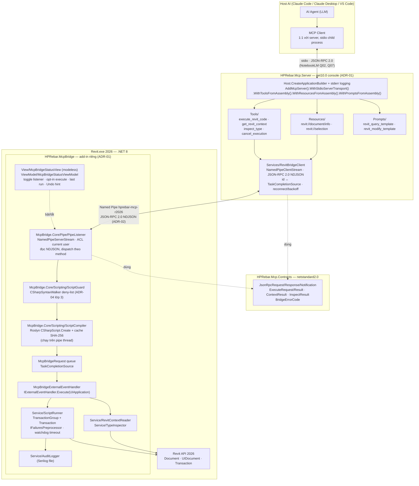
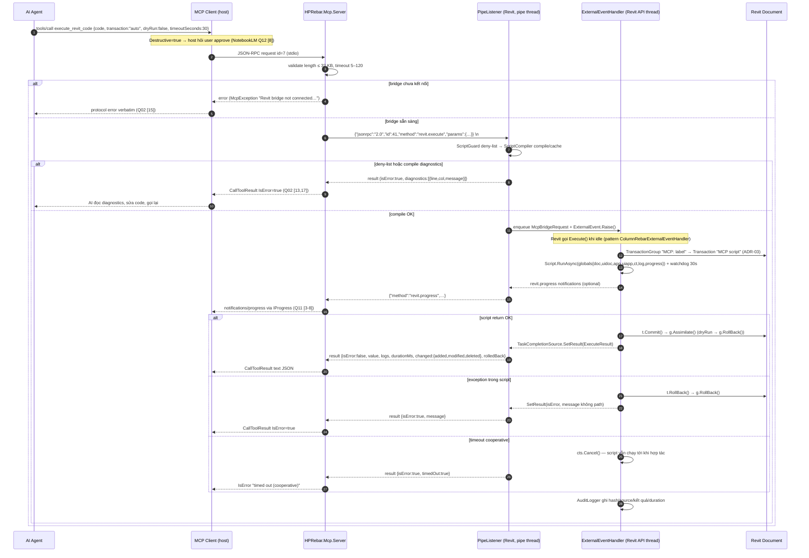

# Dynamic Revit MCP Server 2026 — Architecture

**Ngày:** 2026-09-12 · Nguồn: ADR-01..04, `research/*.md`. Mọi quyết định MCP viện dẫn `NotebookLM Qnn [k]` trong `research/notebooklm-mcp-csharp-report.md`.

## 1. Component diagram



## 2. Sequence — một lần `execute_revit_code`



## 3. Tool surface (server) — tối thiểu, không `create_*`

| Tool (`snake_case`, Q09 [16-17]) | Annotations | Input | Output | Bridge method |
|---|---|---|---|---|
| `execute_revit_code` | `Destructive=true`, `ReadOnly=false` | xem schema §4 | `CallToolResult` text JSON `ExecuteResult` | `revit.execute` |
| `get_revit_context` | `ReadOnly=true`, `Idempotent=true` | `{ includeSelection?: bool }` | `{revitVersion, docTitle, docPath?, isFamily, isReadOnly, units:{length,…}, activeView:{id,name,type}, selection:[{id,category,name}], openDocs:[…]}` | `revit.context` |
| `inspect_type` | `ReadOnly=true`, `Idempotent=true` | `{ typeName: string, memberFilter?: string, maxMembers?: int }` | public members của type Revit API (reflection trong bridge) — AI tự khám phá API thay vì đoán | `revit.inspect` |
| `cancel_execution` | `Idempotent=true` | `{}` | `{cancelled: bool, wasRunning: bool}` | `revit.cancel` |

Resources (`[McpServerResource(UriTemplate=…, MimeType="application/json")]`, Q05 [8-16]): `revit://document/info`, `revit://selection`. Bridge gửi `revit.status` khi selection/doc đổi → server phát `notifications/resources/updated` (Q05 [30-35]).

Prompts (`[McpServerPrompt]` trả `ChatMessage[]`, Q06 [16-21]): `revit_query_template` (đọc-only, `transaction:"none"`), `revit_modify_template` (dryRun trước, rồi `auto`). Persona System + ví dụ User/Assistant few-shot cho cú pháp globals.

DI (Q08): `RevitBridgeClient` singleton; `IOptions<BridgeOptions>` (pipe name, timeouts, limits) từ `appsettings.json`; tool class instance + constructor injection; `ILogger<T>` → stderr. Server không giữ state Revit.

## 4. JSON schema `execute_revit_code` (SDK sinh từ tham số C# — Q04 [26-33]; ghi tường minh để làm contract)

```json
{
  "type": "object",
  "properties": {
    "code": {
      "type": "string",
      "description": "C# script body. Globals: doc (Document), uidoc (UIDocument), app (Application), uiapp (UIApplication), ct (CancellationToken), log(string), progress(int current, int total, string msg). Use `return <value>;` to send a result. Default usings: System, System.Linq, System.Collections.Generic, Autodesk.Revit.DB, Autodesk.Revit.UI, Autodesk.Revit.DB.Structure. Max 32 KB."
    },
    "transaction": {
      "type": "string",
      "enum": ["auto", "manual", "none"],
      "description": "auto = server wraps one Transaction (default). manual = you open Transaction(s) yourself inside one TransactionGroup. none = read-only; any modification fails."
    },
    "dryRun": {
      "type": "boolean",
      "description": "Run then roll back everything. Use first for destructive changes."
    },
    "timeoutSeconds": { "type": "integer", "minimum": 5, "maximum": 120 },
    "label": {
      "type": "string",
      "description": "Short name shown in Revit Undo history as 'MCP: <label>'."
    }
  },
  "required": ["code"]
}
```

`ExecuteResult` (text block JSON):
```json
{
  "isError": false,
  "value": 42,
  "valueType": "System.Int32",
  "logs": ["…"],
  "diagnostics": [{ "line": 3, "column": 12, "id": "CS0103", "message": "…" }],
  "changed": { "added": 0, "modified": 0, "deleted": 0 },
  "rolledBack": false,
  "timedOut": false,
  "durationMs": 118,
  "truncated": false
}
```

## 5. IPC envelope (ADR-02) — JSON-RPC 2.0, một object mỗi dòng

```json
{"jsonrpc":"2.0","id":41,"method":"revit.execute","params":{"code":"return doc.Title;","transaction":"none","dryRun":false,"timeoutSeconds":30,"label":"title"}}
{"jsonrpc":"2.0","method":"revit.progress","params":{"id":41,"progress":2,"total":5,"message":"collecting walls"}}
{"jsonrpc":"2.0","id":41,"result":{"isError":false,"value":"Project1","valueType":"System.String","logs":[],"changed":{"added":0,"modified":0,"deleted":0},"rolledBack":false,"timedOut":false,"durationMs":9,"truncated":false}}
{"jsonrpc":"2.0","id":42,"error":{"code":-32601,"message":"Method not found: revit.foo"}}
```

Error codes bridge: `-32700` parse, `-32600` invalid request, `-32601` method not found, `-32000` bridge internal, `-32001` execution disabled (opt-in OFF), `-32002` busy (script khác đang chạy), `-32003` no active document. Server map `-32001..-32003` → `CallToolResult.IsError` (AI sửa được), còn lại → `McpException`.

## 6. Project layout đề xuất

```
HPRebar/
├── HPRebar.slnx                       ← thêm 3 project; McpBridge chỉ build R25/R26 configs
├── HPRebar.Mcp.Contracts/             netstandard2.0 · System.Text.Json
│   ├── JsonRpc/                        JsonRpcRequest.cs, JsonRpcResponse.cs, JsonRpcNotification.cs, JsonRpcError.cs
│   └── Messages/                       ExecuteRequest.cs, ExecuteResult.cs, ContextResult.cs, InspectRequest.cs, InspectResult.cs, BridgeErrorCode.cs
├── HPRebar.Mcp.Server/                net10.0 · ModelContextProtocol 2.2.0 · Microsoft.Extensions.Hosting 10.0.12 (verified 2026-09-12; sách ghi 1.3.0/10.0.3)
│   ├── Program.cs                      CreateApplicationBuilder(ContentRootPath=BaseDirectory) + AddConsole(LogToStandardErrorThreshold=Trace) + AddMcpServer chain (theo SDK sample)
│   ├── appsettings.json                Bridge: pipe/timeouts/limits
│   ├── Models/BridgeOptions.cs
│   ├── Services/RevitBridgeClient.cs, NdjsonPipeTransport.cs, ResultFormatter.cs
│   ├── Tools/ExecuteRevitCodeTool.cs, RevitContextTool.cs, InspectTypeTool.cs, CancelExecutionTool.cs
│   ├── Resources/RevitDocumentResources.cs
│   └── Prompts/RevitScriptPrompts.cs
├── HPRebar.McpBridge.Core/            net8.0 · Roslyn 5.9.0 · Serilog · KHÔNG Revit refs → xUnit (đã build, phase 2)
│   ├── Pipe/   PipeListener.cs, NdjsonPipeWriter.cs, RequestDispatcher.cs, IRevitExecutor.cs   (đã có)
│   ├── Model/  BridgeSettings.cs (+ScriptProgress, LastRunInfo), BridgeStatus.cs, BridgeSettingsStore.cs (đã có)
│   └── Scripting/ ScriptGuard.cs, ScriptCompiler.cs, ScriptCache.cs   (phase 4)
├── HPRebar.McpBridge/                 net8.0-windows7.0 · Nice3point.Revit.Sdk · Configurations Debug.R25;Debug.R26;Release.R25;Release.R26
│   ├── HPRebar.McpBridge.addin         AddInId mới, FullClassName HPRebar.McpBridge.Application
│   ├── Application.cs                  ribbon button "MCP Bridge"
│   ├── McpBridgeCommand.cs             mở status window (static field giữ window)
│   ├── McpBridgeExternalEventHandler.cs
│   ├── McpBridgeRequest.cs
│   ├── Model/  ScriptGlobals.cs, ExecutionOutcome.cs, BridgeSettings.cs
│   ├── Service/ McpBridgeHost.cs (đã có), ScriptRunner.cs, RevitContextReader.cs, TypeInspector.cs, AuditLogger.cs, AutoDismissFailurePreprocessor.cs, ResultSerializer.cs
│   ├── View/   McpBridgeStatusView.xaml(.cs)
│   └── ViewModel/ McpBridgeStatusViewModel.cs, IMcpBridgeRunner.cs
├── HPRebar.Mcp.Server.Tests/          net10.0 · xUnit v3 · in-memory Pipe transport (Q10 [63-78]) + pure tests cho McpBridge.Scripting
└── HPRebar.McpBridge.Tests/           TUnit in-process (R26) — guard/transaction/timeout thật; ScriptGuard walker test thuần đặt ở đây hoặc Core.Tests
```

Ghi chú: R25 cùng net8 nên build "miễn phí"; R23/R24 (net48) và R27 (net10) ngoài scope v1 — phase-01.

## 7. Lifecycle

- **Server:** host AI launch (`.mcp.json` / `claude_desktop_config.json` / `.vscode/mcp.json`, Q09 [36-41], Q10 [22-38]) → initialize/capabilities (Q03) → lazy connect pipe khi tool đầu tiên gọi → stdin đóng → dispose pipe → exit (Q03 [9]).
- **Bridge:** Revit start → ribbon → user mở status window → bật listener (mặc định OFF, có option auto-start) → `NamedPipeServerStream.WaitForConnectionAsync` loop → Revit exit → `Dispose` ExternalEvent + pipe.
- **Trạng thái busy:** một script tại một thời điểm; request thứ 2 nhận `-32002` ngay (AI chờ/hỏi user).
