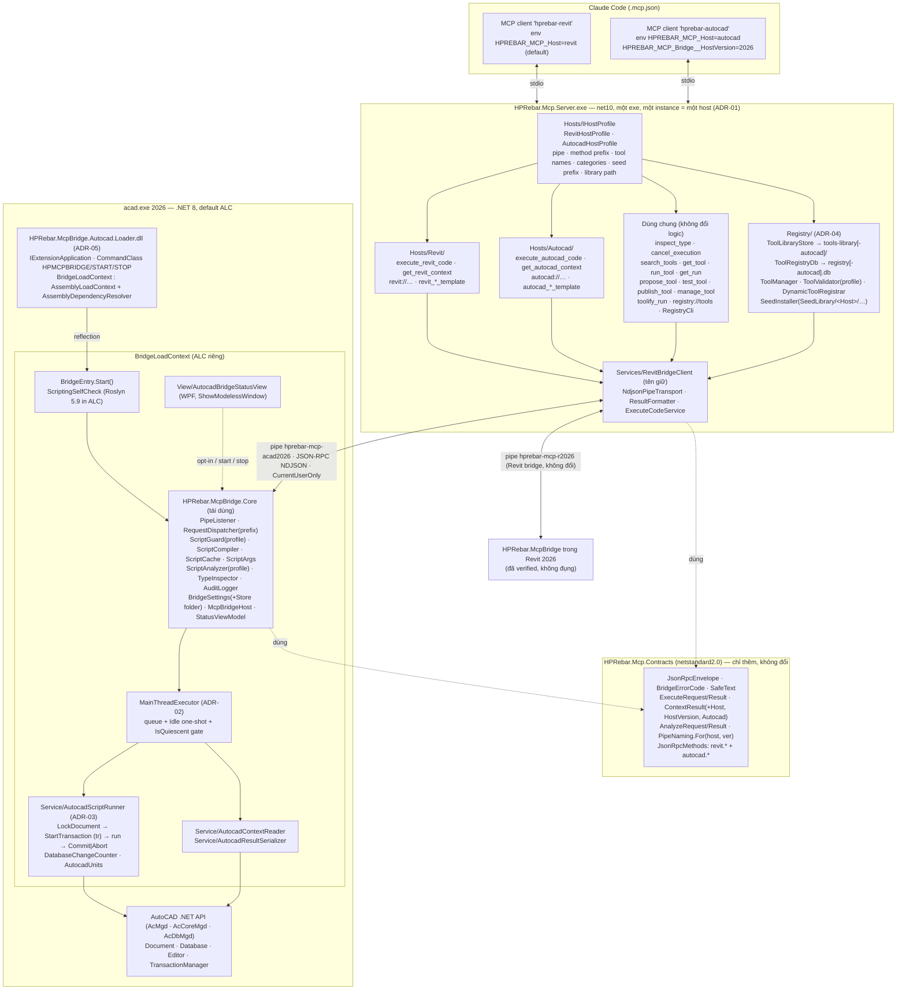

# HPRebar AutoCAD MCP Bridge 2026 — Architecture

**Ngày:** 2026-09-13 · Nguồn: [ADR-01..05](adr/), [research/](research/), kiến trúc Revit gốc [`../260912-1521-dynamic-revit-mcp-server-2026/architecture.md`](../260912-1521-dynamic-revit-mcp-server-2026/architecture.md) (không sửa). Mọi quyết định MCP viện dẫn NotebookLM Q01–Q12 (report Revit) + Q13 (addendum ở đây).

Nguyên tắc giữ nguyên từ Revit: 2 tiến trình (ADR-01 Revit) · Named Pipe JSON-RPC 2.0 NDJSON (ADR-02 Revit) · Roslyn in-process, compile trên pipe thread, run trên main thread (ADR-03 Revit) · opt-in OFF mỗi lần mở host, deny-list, timeout cooperative luôn fail + rollback, audit (ADR-04 Revit) · tool = data, không command native (ADR-05 Revit) · registry files + SQLite, publish gate `manual` (ADR-06 Revit).

## 1. Component diagram



## 2. Sequence — `execute_autocad_code` + vòng lặp registry (MISS → tool)

```mermaid
sequenceDiagram
    autonumber
    participant AI as AI (Claude)
    participant S as Server (host=autocad)
    participant P as Bridge pipe thread
    participant M as AutoCAD main thread
    participant H as Human

    AI->>S: search_tools "vẽ lưới trục" → miss
    AI->>S: execute_autocad_code {code, transaction:auto, dryRun:true, timeoutSeconds:30, label, args}
    S->>S: size ≤ 32 KB, mode normalize, label ≤ 64 (ExecuteCodeService — mã Revit tách ra)
    S->>P: {"method":"autocad.execute", params} \n
    P->>P: ScriptGuard(autocad profile: + Editor.Get*, SendStringToExecute, tr.Commit) → ScriptCompiler (cache SHA-256)
    alt guard / compile error
        P-->>S: result {isError:true, diagnostics}
        S-->>AI: CallToolResult IsError (AI sửa code)
    else OK
        P->>M: enqueue + Application.Idle += OnIdle
        M->>M: IsQuiescent? (grace 10 s → Busy -32002)
        M->>M: LockDocument → tr = StartTransaction → DatabaseChangeCounter on
        M->>M: script.RunAsync(globals{doc,db,ed,app,tr,units,ct,log,progress,args})
        alt return OK & không timeout
            M->>M: dryRun → tr.Abort() (rolledBack) | else tr.Commit()
        else exception / timeout / cancel / none+modified
            M->>M: tr.Abort() → rolledBack, message
        end
        M-->>P: TCS.SetResult(ExecuteResult) → AuditLogger
        P-->>S: result {value, logs, changed, rolledBack, durationMs}
        S->>S: ToolManager.RecordAdhoc → runId; LooksReusable → hint
        S-->>AI: ExecuteResult + runId + hint
    end
    AI->>S: execute_autocad_code (dryRun:false) → commit thật
    AI->>S: get_run runId → code + literals (autocad.analyze trên pipe thread)
    AI->>S: prompt toolify_run → propose_tool {name, category:Drawing, inputSchema, code(args.*), examples≥2}
    S->>S: ToolValidator(profile autocad) + autocad.analyze → draft (host:"autocad")
    AI->>S: test_tool → run examples dryRun → tested
    AI->>S: publish_tool → pending_approval + _review/<name>.md
    H->>S: HPRebar.Mcp.Server.exe registry approve <name> --by <who> [--host autocad]
    S->>S: FileSystemWatcher → LoadAll → DynamicToolRegistrar.Sync → notifications/tools/list_changed
    AI->>S: search_tools (hit) → gọi <name>{args} trực tiếp → runs/stability; ≥5 run & >40 % lỗi → quarantined
```

## 3. Tool surface — instance `host=autocad` (`tools/list` = 4 + 8 + N seed/published)

| Tool | Annotations | Input | Bridge method | Mã |
|---|---|---|---|---|
| `execute_autocad_code` | `Destructive=true` | `code`, `transaction` (auto/manual/none), `dryRun`, `timeoutSeconds` 5–120, `label`, `args` (JSON object) — **y hệt Revit** | `autocad.execute` | `Hosts/Autocad/ExecuteAutocadCodeTool` (mỏng) → `Services/ExecuteCodeService` (tách từ `ExecuteRevitCodeTool`) |
| `get_autocad_context` | `ReadOnly` | `includeSelection` | `autocad.context` | `Hosts/Autocad/AutocadContextTool` → `ContextResult` (+ `Host`, `HostVersion`, `Autocad{insunits, measurement, currentLayout, currentLayer, isModelSpace, isQuiescent, isNamedDrawing}`) |
| `inspect_type` | `ReadOnly` | `typeName`, `memberFilter`, `maxMembers` | `autocad.inspect` | **dùng chung** (description trung tính; `TypeInspector` nhận assemblies AutoCAD) |
| `cancel_execution` | `Idempotent` | — | `autocad.cancel` | **dùng chung** |
| 8 registry tool | như Revit | như Revit | `autocad.execute` / `autocad.analyze` | **dùng chung** (ADR-04) |
| seed/published (12+) | `Destructive` trừ `transaction=none` | `inputSchema` từ `tool.json` + `dryRun` | `autocad.execute` | `DynamicToolRegistrar` dùng chung |

Resources: `autocad://document/info`, `autocad://selection` (mirror `RevitDocumentResources`), `registry://tools[/{name}]` dùng chung. Prompts: `autocad_query_template`, `autocad_modify_template` (persona AutoCAD, few-shot `tr.GetObject`, `units.ToDrawing`), `toolify_run` dùng chung (persona từ `IHostProfile`).

**Script contract AutoCAD** (description tool + prompt): globals `doc` (Document), `db` (Database), `ed` (Editor — chỉ `WriteMessage/SelectImplied/SelectAll`), `app` (DocumentCollection), **`tr`** (Transaction ngoài cùng, không Commit/Abort), **`units`** (`ToDrawing(mm)`, `ToMm(du)`, `Insunits`), `ct`, `log`, `progress`, `args`; kết thúc `return`. Default usings: `System`, `System.Linq`, `System.Collections.Generic`, `Autodesk.AutoCAD.ApplicationServices`, `Autodesk.AutoCAD.DatabaseServices`, `Autodesk.AutoCAD.EditorInput`, `Autodesk.AutoCAD.Geometry`, `Autodesk.AutoCAD.Colors`, `HPRebar.McpBridge.Core.Scripting`. **Không** import `Autodesk.AutoCAD.Runtime` (`Exception` trùng `System.Exception` → CS0104; script viết `Autodesk.AutoCAD.Runtime.ErrorStatus` đầy đủ) và **không** `ApplicationServices.Core` (trùng `Application`). References: `AcMgd`, `AcCoreMgd`, `AcDbMgd`, `System.Runtime`, `System.Linq`, `System.Collections`, `netstandard`, `HPRebar.McpBridge.Core`, `System.Text.Json`.

## 4. IPC (Contracts — chỉ thêm)

- Pipe: `PipeNaming.For("autocad", 2026)` → `hprebar-mcp-acad2026` (Revit vẫn `hprebar-mcp-r2026` qua overload cũ). Hai bridge chạy song song trong hai tiến trình khác nhau, hai pipe khác tên → **không xung đột**; cả hai `CurrentUserOnly`, `maxNumberOfServerInstances=1` (instance AutoCAD thứ hai fail-fast như Revit).
- Methods: `autocad.ping|context|inspect|execute|cancel|analyze`; notifications `autocad.progress|log|status`. `RequestDispatcher` (Core) so khớp **suffix sau dấu chấm** → chấp nhận cả `revit.*` (bridge Revit đã deploy không cần rebuild) và `autocad.*`; server lấy prefix từ `IHostProfile.MethodPrefix`.
- Envelope, error codes (`-32001` disabled, `-32002` busy — dùng cả cho "AutoCAD đang trong command/dialog", `-32003` no document), `SafeText.StripPaths`, trần 4 MB: **giữ nguyên**.
- `StatusParams.RevitVersion`/`BridgePingResult.RevitVersion`: bridge AutoCAD điền `"2026"` (tên field giữ để không phá wire với Revit; ngữ nghĩa = host version, ghi docs).

## 5. Layout project (mới ⊕, sửa ✎, giữ ＝)

```
HPRebar/
├── HPRebar.slnx                              ✎ +2 project (folder /Mcp/), map mọi R## → Debug/Release
├── HPRebar.Mcp.Contracts/                    ✎ additive: PipeNaming.For(host,ver) · JsonRpcMethods autocad.* + Suffix() · ContextResult +Host/HostVersion/Autocad · AutocadInfo record
├── HPRebar.Mcp.Server/
│   ├── Program.cs                            ✎ Host config → IHostProfile; đăng ký host tools/prompts/resources theo profile; ServerInfo.Name
│   ├── appsettings.json                      ✎ "Host": "revit"; Bridge.HostVersion (RevitVersion alias)
│   ├── Hosts/IHostProfile.cs                 ⊕
│   ├── Hosts/Revit/RevitHostProfile.cs       ⊕ (giá trị = hằng hiện tại)
│   ├── Hosts/Revit/{ExecuteRevitCodeTool,RevitContextTool,RevitDocumentResources,RevitScriptPrompts}.cs   ✎ di chuyển file (git mv), thân → service
│   ├── Hosts/Autocad/AutocadHostProfile.cs   ⊕
│   ├── Hosts/Autocad/{ExecuteAutocadCodeTool,AutocadContextTool,AutocadDocumentResources,AutocadScriptPrompts}.cs   ⊕
│   ├── Services/ExecuteCodeService.cs        ⊕ (tách từ ExecuteRevitCodeTool.ExecuteAsync)
│   ├── Services/ContextService.cs            ⊕ (tách từ RevitContextTool + RevitDocumentResources)
│   ├── Services/{RevitBridgeClient,NdjsonPipeTransport,ResultFormatter,RegistryStartup,BridgeExceptions}.cs   ＝ (thông điệp "Revit bridge not connected" → profile.DisplayName)
│   ├── Models/BridgeOptions.cs               ✎ HostVersion + RevitVersion alias; IsValid theo profile.ValidVersions
│   ├── Tools/{InspectTypeTool,CancelExecutionTool}.cs   ✎ description trung tính
│   ├── Tools/Registry/*.cs                   ✎ chỉ description text (tên tool từ profile khi cần)
│   ├── Prompts/ToolifyPrompts.cs             ✎ persona từ IHostProfile (DI param)
│   ├── Registry/Model/{RegistryOptions,ToolRecord}.cs   ✎ default path theo profile; +Host, +HostVersions
│   ├── Registry/{ToolManager,ToolValidator,ToolLifecycleService,SeedInstaller,DynamicToolRegistrar}.cs   ✎ host filter · categories/reserved từ profile · seed prefix theo host · description
│   ├── Registry/{ToolLibraryStore,ToolRegistryDb,StabilityScorer,RegistryCli}.cs   ＝ (CLI + --host)
│   └── Registry/SeedLibrary/Revit/**  ✎ git mv 21 seed · Registry/SeedLibrary/Autocad/** ⊕ 12 seed
├── HPRebar.McpBridge.Core/
│   ├── Pipe/RequestDispatcher.cs             ✎ so khớp suffix method; thông điệp dùng hostName
│   ├── Pipe/IRevitExecutor.cs                ✎ đổi tên IBridgeExecutor (Revit bridge implement tên mới — 1 dòng)
│   ├── Scripting/ScriptGuard.cs              ✎ GuardProfile { HostName, ExtraDeniedIdentifiers, ExtraDeniedMembers, DeniedMembersOn["tr"] }
│   ├── Scripting/ScriptAnalyzer.cs           ✎ AnalyzerProfile { TransactionTypeNames, TransactionMethodNames }
│   ├── Scripting/{ScriptCompiler,ScriptCache,ScriptArgs,TypeInspector}.cs   ＝ (TypeInspector message "in the Revit API assemblies" → hostName)
│   ├── Model/BridgeSettingsStore.cs          ✎ productFolder tham số ("McpBridge" | "McpBridge.Autocad")
│   ├── Model/{BridgeSettings,BridgeStatus,AuditLogger}.cs   ＝
│   ├── Host/McpBridgeHost.cs                 ⊕ di chuyển từ HPRebar.McpBridge/Service (Revit-free, PipeName từ tham số)
│   └── ViewModel/{IMcpBridgeRunner,McpBridgeStatusViewModel}.cs   ⊕ di chuyển từ HPRebar.McpBridge (Core thêm CommunityToolkit.Mvvm 8.4.0)
├── HPRebar.McpBridge/                        ✎ chỉ sửa using/namespace theo các di chuyển trên; hành vi không đổi; redeploy Revit KHÔNG bắt buộc cho MVP AutoCAD
├── HPRebar.McpBridge.Autocad.Loader/         ⊕ net8.0-windows · AutoCAD.NET [25.1.0] ExcludeAssets=runtime · IExtensionApplication · CommandClass · BridgeLoadContext
├── HPRebar.McpBridge.Autocad/                ⊕ net8.0-windows · UseWPF · EnableDynamicLoading
│   ├── BridgeEntry.cs                        Start()/handle delegates; ScriptingSelfCheck
│   ├── MainThreadExecutor.cs                 IBridgeExecutor (ADR-02)
│   ├── AutocadBridgeRequest.cs               mirror McpBridgeRequest
│   ├── Model/{AutocadScriptGlobals,AutocadUnits}.cs
│   ├── Service/{AutocadScriptRunner,AutocadContextReader,AutocadResultSerializer,DatabaseChangeCounter,ScriptingSelfCheck}.cs
│   ├── View/AutocadBridgeStatusView.xaml(.cs) (theme tối giản, không link Theme HPRebar)
│   ├── Bundle/PackageContents.xml + DeployBundle target trong csproj
│   └── Properties/launchSettings.json (acad.exe)
└── HPRebar.Mcp.Server.Tests/                 ✎ + HostProfileTests · DispatcherPrefixTests · RegistryHostFilterTests · SeedLibraryTests theory theo host (AutoCAD refs từ NuGet cache) · GuardProfileTests · ExecuteCodeService tests
```

Ghi chú feature-folder convention của CLAUDE.md áp cho **add-in Revit**; project bridge AutoCAD không phải Nice3point add-in nhưng vẫn giữ `Model/ Service/ View/ ViewModel/` + file gốc `MainThreadExecutor.cs`, `AutocadBridgeRequest.cs` cho đồng nhất.

## 6. Ma trận tái dùng (từng file hiện có)

| Nhóm | Tái dùng **nguyên** | **Tách ra chung** / sửa tối thiểu | **Viết mới cho AutoCAD** |
|---|---|---|---|
| Contracts | `JsonRpcEnvelope`, `JsonRpcError`, `BridgeErrorCode`, `BridgeJson`, `SafeText`, `ExecuteRequest`, `ExecuteResult`, `AnalyzeMessages`, `SynchronousProgress` | `PipeNaming` (+overload), `JsonRpcMethods` (+`autocad.*`, `Suffix`), `ContextMessages` (+`Host`, `HostVersion`, `AutocadInfo`) | — |
| Pipe transport | `NdjsonPipeWriter`, `PipeListener`, server `NdjsonPipeTransport`, `RevitBridgeClient` | `RequestDispatcher` (suffix, hostName) | — |
| Scripting | `ScriptCompiler`, `ScriptCache`, `ScriptArgs`, `TypeInspector` | `ScriptGuard` (`GuardProfile`), `ScriptAnalyzer` (`AnalyzerProfile`) | `AutocadScriptGlobals`, `AutocadUnits`, `AutocadScriptRunner`, `AutocadResultSerializer`, `AutocadContextReader`, `DatabaseChangeCounter`, `MainThreadExecutor` |
| Settings / audit / UI | `BridgeSettings`, `BridgeStatus`, `AuditLogger` | `BridgeSettingsStore` (folder), `McpBridgeHost` + `IMcpBridgeRunner` + `McpBridgeStatusViewModel` (move → Core) | `AutocadBridgeStatusView.xaml`, `BridgeEntry`, Loader project |
| Server core tools | `InspectTypeTool`, `CancelExecutionTool` (description) | `ExecuteRevitCodeTool` → `ExecuteCodeService`; `RevitContextTool` + `RevitDocumentResources` → `ContextService` | `ExecuteAutocadCodeTool`, `AutocadContextTool`, `AutocadDocumentResources`, `AutocadScriptPrompts`, `AutocadHostProfile` |
| Registry | `ToolLibraryStore`, `ToolRegistryDb`, `StabilityScorer`, `RegistryCli`, `Tools/Registry/*` (logic), `RegistryStartup` | `RegistryOptions` (defaults), `ToolRecord` (+Host/HostVersions), `ToolManager` (host filter), `ToolValidator` (profile), `ToolLifecycleService` (HostVersions, review file), `SeedInstaller` (host prefix), `DynamicToolRegistrar` (description), `ToolifyPrompts` (persona DI) | 12 seed `SeedLibrary/Autocad/**` |
| ResultFormatter | `ResultFormatter` | thông điệp `McpException` "Revit bridge error" → `profile.DisplayName` | — |
| Tests | `PipeRoundTripTests`, `BridgeUnavailableTests`, `ScriptCompilerTests`, `ScriptArgsAndAnalyzerTests`, `ScriptGuardTests`, `Registry/*Tests`, `Fakes/FakeRevitExecutor` | `SeedLibraryTests` (theory theo host, reference set theo host) | `HostProfileTests`, `DispatcherPrefixTests`, `RegistryHostFilterTests`, `GuardProfileAutocadTests`, `MainThreadExecutorTests` (giả lập Idle) |

## 7. Bảng so sánh Revit ↔ AutoCAD (ánh xạ khái niệm bridge)

| # | Khái niệm bridge | Revit (đã verified) | AutoCAD 2026 (.NET 8) | Ghi chú thiết kế |
|---|---|---|---|---|
| 1 | Tài liệu đang mở | `UIApplication.ActiveUIDocument.Document` | `Application.DocumentManager.MdiActiveDocument` → `.Database`, `.Editor` | `null` → `-32003`. Globals `doc/db/ed` thay `doc/uidoc` |
| 2 | Chạy trên thread API | `ExternalEvent.Raise()` → `IExternalEventHandler.Execute(UIApplication)` | `Application.Idle` one-shot + `IsQuiescent` gate (ADR-02); `ExecuteInApplicationContext` [spike] | Cùng queue + `TaskCompletionSource` |
| 3 | Host bận / modal | `Raise()` → `Denied`/`Pending` → lỗi ngay | `!IsQuiescent` → chờ tới `BusyGraceSeconds` → `-32002` | AI thấy "press ESC / close dialog" |
| 4 | Khoá tài liệu | không cần (Execute đã trong API context) | `doc.LockDocument()` bắt buộc (application context) | `using var dl = doc.LockDocument();` trước transaction |
| 5 | Nhóm undo + rollback | `TransactionGroup` (`Assimilate`/`RollBack`) + `Transaction` | **Transaction ngoài cùng** do bridge mở (`tr`); `Abort()` huỷ mọi nested kể cả đã Commit | dryRun = `Abort()`; không đặt được tên mục Undo |
| 6 | `transaction=none` | không mở transaction; Revit ném `ModificationOutsideTransactionException` | vẫn mở `tr` (đọc cần transaction), **luôn Abort**; `Changed ≠ 0` → `IsError` | ngữ nghĩa với AI giống nhau |
| 7 | Đơn vị | API = feet; `UnitUtils` mm ↔ ft; `doc.GetUnits()` | Toạ độ **unitless**; `db.Insunits` (`UnitsValue`) chỉ là nhãn; `db.Measurement` | global `units` (mm ↔ drawing unit theo `Insunits`) |
| 8 | Định danh phần tử | `ElementId.Value` (long, ổn định trong file) | `ObjectId` (theo phiên) · `ObjectId.Handle` / `Handle.Value` (long, bền trong DWG) | serializer trả `handle` hex; `ElementInfo.Id` = `Handle.Value` |
| 9 | Phân loại | `Element.Category` (BuiltInCategory), `ElementType` | `Entity.Layer` + `ObjectId.ObjectClass.DxfName` (`LINE`, `LWPOLYLINE`, `INSERT`…) | `ElementInfo.Category` = layer, `Name` = DxfName |
| 10 | Truy vấn | `FilteredElementCollector.OfClass/OfCategory` | duyệt `BlockTableRecord` (`SymbolUtilityServices.GetBlockModelSpaceId`) qua `tr.GetObject`, hoặc `ed.SelectAll(SelectionFilter{DxfCode.Start, DxfCode.LayerName})` | seed `get_entities` dùng `SelectAll` (nhanh, không cần duyệt) |
| 11 | Lựa chọn hiện tại | `uidoc.Selection.GetElementIds()` | `ed.SelectImplied()` (pickfirst) · `ed.SetImpliedSelection(ids)` | phải chạy trên main thread |
| 12 | View / ngữ cảnh hiển thị | `uidoc.ActiveView` (Level/View/Sheet) | `LayoutManager.Current` (Model / layout) · `db.TileMode` (model space?) · `db.Clayer` (layer hiện hành) · `Viewport` | `ContextResult.ActiveView` = layout hiện tại; `AutocadInfo` bổ sung |
| 13 | Đếm thay đổi | `Application.DocumentChanged` (`GetAddedElementIds/Modified/Deleted`) | `Database.ObjectAppended/ObjectModified/ObjectErased` (bắn trong transaction, trước Commit) | `HashSet<ObjectId>`; đếm cả khi Abort (dryRun báo "would change") |
| 14 | Lỗi API | `Autodesk.Revit.Exceptions.*` | `Autodesk.AutoCAD.Runtime.Exception.ErrorStatus` (`eLockViolation`, `eNotOpenForWrite`, …) | message `"{ErrorStatus}: {Message}"` |
| 15 | Dialog khi chạy | `IFailuresPreprocessor` tự dismiss warning | không có failure engine; rủi ro là **prompt** (`ed.Get*`) → guard deny; sysvar `FILEDIA/CMDECHO/NOMUTT` không cần cho API thuần | — |
| 16 | Phản chiếu API | `TypeInspector(RevitAPI, RevitAPIUI)` | `TypeInspector(AcMgd, AcCoreMgd, AcDbMgd)` | tái dùng nguyên class |
| 17 | Nạp add-in / cách ly | `.addin` + `<ContextName>` (ALC do Revit tạo) | bundle `PackageContents.xml` + **ALC tự tạo** trong loader (ADR-05) | Revit: Nice3point; AutoCAD: `Microsoft.NET.Sdk` thường |
| 18 | Phiên bản host | `Application.VersionNumber` ("2026") | `Application.Version` (`System.Version` 25.1.x) → bảng series→năm (R25.1 = 2026) | `StatusParams.RevitVersion` = "2026" |
| 19 | Cửa sổ modeless | `Window.Show()` (+ owner qua `WindowInteropHelper`) | `Core.Application.ShowModelessWindow(Window)` | ViewModel chung (Core), View riêng |
| 20 | Tài liệu chỉ đọc / family | `doc.IsReadOnly`, `doc.IsFamilyDocument` | `doc.IsReadOnly`, `doc.IsNamedDrawing` (Drawing1.dwg chưa lưu vẫn ghi được) | `AllowFamilyDocuments` không áp dụng |

## 8. Lifecycle

- **Server:** như Revit; thêm bước đầu `Host` → `IHostProfile` → `ServerInfo.Name`. Registry startup đọc library/DB **theo profile** (ADR-04). Một phiên Claude Code có thể chạy 2 instance (2 entry `.mcp.json`) → 2 pipe khác nhau, 2 registry.
- **Bridge AutoCAD:** AutoCAD start → autoloader nạp `Loader.dll` (default ALC) → `Initialize()`: tạo `BridgeLoadContext`, nạp bridge, `BridgeEntry.Start()` (settings load với `ExecutionEnabled=false`, `ScriptingSelfCheck`, `AutoStartListener` → `Start()`), đăng ký command `HPMCPBRIDGE` → user gõ `HPMCPBRIDGE` → status window → bật listener + tick opt-in → `NamedPipeServerStream.WaitForConnectionAsync` → … → AutoCAD exit: `Terminate()` → `handle.Dispose()` (stop listener, dispose audit, `Application.Idle -=`).
- **Busy:** một script/lần (`-32002`); `cancel_execution` chỉ cooperative.
- **Hot-reload dev:** DLL bị khoá khi AutoCAD mở → `-p:DeployBundle=false` cho build kiểm tra; ALC không collectible (Roslyn không unload sạch) → reload = restart AutoCAD (giống Revit).
