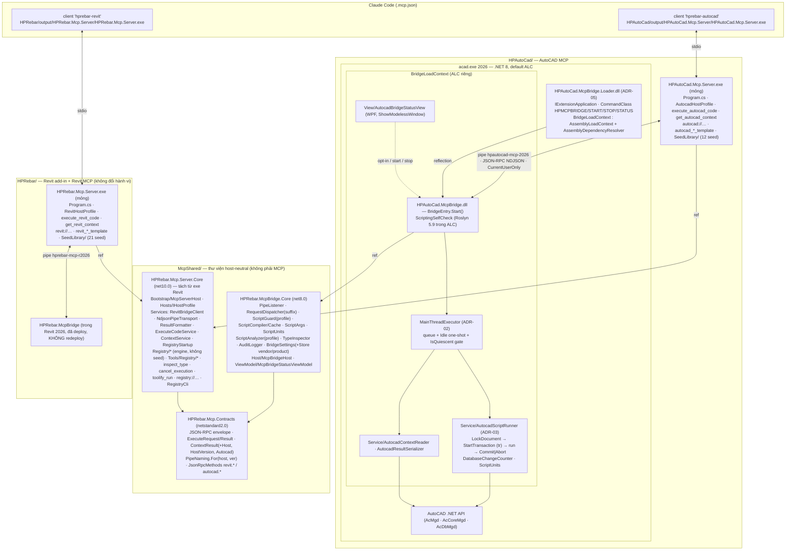

# HPAutoCad MCP Bridge 2026 — Architecture

**Ngày:** 2026-09-13 · **Revised 2026-09-14** theo [ADR-06](adr/adr-06-one-mcp-one-folder.md): mỗi MCP một folder top-level (`HPRebar/`, `HPAutoCad/`), mã chung ở `McpShared/`, **hai exe** — không còn "một exe + host profile qua env". Nguồn: [ADR-01 (superseded phần server)](adr/adr-01-reuse-mcp-server-host-profile.md), [ADR-02..06](adr/), [research/](research/), kiến trúc Revit gốc [`../260912-1521-dynamic-revit-mcp-server-2026/architecture.md`](../260912-1521-dynamic-revit-mcp-server-2026/architecture.md) (không sửa).

Nguyên tắc giữ nguyên từ Revit: 2 tiến trình · Named Pipe JSON-RPC 2.0 NDJSON · Roslyn in-process, compile trên pipe thread, run trên main thread · opt-in OFF mỗi lần mở host, deny-list, timeout cooperative luôn fail + rollback, audit · tool = data, không command native · registry files + SQLite, publish gate `manual`.

## 1. Component diagram



Chiều phụ thuộc duy nhất được phép: **MCP folder → `McpShared/`**. Không bao giờ `HPAutoCad/` → `HPRebar/` hay ngược lại (`CLAUDE.md` "do not cross-wire").

## 2. Sequence — `execute_autocad_code` + vòng lặp registry (MISS → tool)

```mermaid
sequenceDiagram
    autonumber
    participant AI as AI (Claude)
    participant S as HPAutoCad.Mcp.Server.exe
    participant P as Bridge pipe thread (ALC riêng)
    participant M as AutoCAD main thread
    participant H as Human

    AI->>S: search_tools "vẽ lưới trục" → miss
    AI->>S: execute_autocad_code {code, transaction:auto, dryRun:true, timeoutSeconds:30, label, args}
    S->>S: ExecuteCodeService (Server.Core): size ≤ 32 KB, mode normalize, label ≤ 64
    S->>P: {"method":"autocad.execute", params} \n
    P->>P: ScriptGuard(GuardProfile.Autocad) → ScriptCompiler (cache SHA-256)
    alt guard / compile error
        P-->>S: result {isError:true, diagnostics}
        S-->>AI: CallToolResult IsError (AI sửa code)
    else OK
        P->>M: enqueue + Application.Idle += OnIdle
        M->>M: IsQuiescent? (grace 10 s → Busy -32002)
        M->>M: LockDocument → tr = StartTransaction → DatabaseChangeCounter on
        M->>M: script.RunAsync(globals{doc,db,ed,app,tr,units,ct,log,progress,args})
        alt return OK & không timeout
            M->>M: dryRun → tr.Abort() (rolledBack) | else tr.Commit()
        else exception / timeout / cancel / none+modified
            M->>M: tr.Abort() → rolledBack, message
        end
        M-->>P: TCS.SetResult(ExecuteResult) → AuditLogger (%AppData%\HPAutoCad\McpBridge\audit\)
        P-->>S: result {value, logs, changed, rolledBack, durationMs}
        S->>S: ToolManager.RecordAdhoc (registry.db của HPAutoCad) → runId; LooksReusable → hint
        S-->>AI: ExecuteResult + runId + hint
    end
    AI->>S: execute_autocad_code (dryRun:false) → commit thật
    AI->>S: get_run runId → code + literals (autocad.analyze trên pipe thread)
    AI->>S: prompt toolify_run → propose_tool {name, category:Drawing, inputSchema, code(args.*), examples≥2}
    S->>S: ToolValidator(AutocadHostProfile) + autocad.analyze → draft (host:"autocad")
    AI->>S: test_tool → run examples dryRun → tested
    AI->>S: publish_tool → pending_approval + _review/<name>.md
    H->>S: HPAutoCad.Mcp.Server.exe registry approve <name> --by <who>
    S->>S: FileSystemWatcher → LoadAll → DynamicToolRegistrar.Sync → notifications/tools/list_changed
    AI->>S: search_tools (hit) → gọi <name>{args} trực tiếp → runs/stability; ≥5 run & >40 % lỗi → quarantined
```

## 3. Tool surface — `HPAutoCad.Mcp.Server.exe` (`tools/list` = 4 + 8 + N seed/published)

| Tool | Annotations | Input | Bridge method | Mã (folder) |
|---|---|---|---|---|
| `execute_autocad_code` | `Destructive=true` | `code`, `transaction` (auto/manual/none), `dryRun`, `timeoutSeconds` 5–120, `label`, `args` — **y hệt Revit** | `autocad.execute` | `HPAutoCad/HPAutoCad.Mcp.Server/Tools/ExecuteAutocadCodeTool.cs` (mỏng) → `McpShared/…Server.Core/Services/ExecuteCodeService.cs` |
| `get_autocad_context` | `ReadOnly` | `includeSelection` | `autocad.context` | `HPAutoCad/…/Tools/AutocadContextTool.cs` → `ContextService`; `ContextResult` + `Autocad{insunits, measurement, currentLayout, currentLayer, isModelSpace, isQuiescent, isNamedDrawing}` |
| `inspect_type` | `ReadOnly` | `typeName`, `memberFilter`, `maxMembers` | `autocad.inspect` | **dùng chung** (`Server.Core`, description trung tính) |
| `cancel_execution` | `Idempotent` | — | `autocad.cancel` | **dùng chung** (`Server.Core`) |
| 8 registry tool | như Revit | như Revit | `autocad.execute` / `autocad.analyze` | **dùng chung** (`Server.Core`, ADR-04) |
| seed/published (12+) | `Destructive` trừ `transaction=none` | `inputSchema` từ `tool.json` + `dryRun` | `autocad.execute` | `DynamicToolRegistrar` dùng chung; seed nhúng trong exe AutoCAD |

Resources: `autocad://document/info`, `autocad://selection` (exe AutoCAD; mirror `RevitDocumentResources`), `registry://tools[/{name}]` dùng chung. Prompts: `autocad_query_template`, `autocad_modify_template` (exe AutoCAD), `toolify_run` dùng chung (persona từ `IHostProfile`). `ServerInfo.Name` = `HPAutoCad MCP`.

**Script contract AutoCAD** (description tool + prompt): globals `doc` (Document), `db` (Database), `ed` (Editor — chỉ `WriteMessage/SelectImplied/SelectAll`), `app` (DocumentCollection), **`tr`** (Transaction ngoài cùng, không Commit/Abort), **`units`** (`HPRebar.McpBridge.Core.Scripting.ScriptUnits`: `ToDrawing(mm)`, `ToMm(du)`, `Label`), `ct`, `log`, `progress`, `args`; kết thúc `return`. Default usings: `System`, `System.Linq`, `System.Collections.Generic`, `Autodesk.AutoCAD.ApplicationServices`, `Autodesk.AutoCAD.DatabaseServices`, `Autodesk.AutoCAD.EditorInput`, `Autodesk.AutoCAD.Geometry`, `Autodesk.AutoCAD.Colors`, `HPRebar.McpBridge.Core.Scripting`. **Không** import `Autodesk.AutoCAD.Runtime` (`Exception` trùng `System.Exception` → CS0104) và **không** `ApplicationServices.Core` (trùng `Application`). Danh sách import là hằng trong Contracts (`HostScriptContracts.AutocadImports`) để bridge, description và test compile-check dùng chung một nguồn.

## 4. IPC (Contracts — chỉ thêm)

- Pipe: `PipeNaming.For("autocad", 2026)` → `hpautocad-mcp-2026`; Revit vẫn `hprebar-mcp-r2026` (overload cũ). Hai bridge trong hai tiến trình, hai pipe khác tên → **không xung đột**; cả hai `CurrentUserOnly`, `maxNumberOfServerInstances=1`.
- Methods: `autocad.ping|context|inspect|execute|cancel|analyze`; notifications `autocad.progress|log|status`. `RequestDispatcher` (Core) so khớp **suffix** → chấp nhận cả `revit.*` (bridge Revit đã deploy không cần rebuild) và `autocad.*`; mỗi exe gửi prefix của `IHostProfile.MethodPrefix`.
- Envelope, error codes (`-32001` disabled, `-32002` busy — dùng cả cho "AutoCAD đang trong command/dialog", `-32003` no document), `SafeText.StripPaths`, trần 4 MB: **giữ nguyên**.
- `StatusParams.RevitVersion`/`BridgePingResult.RevitVersion`: bridge AutoCAD điền `"2026"` (tên field giữ để không phá wire với Revit; ngữ nghĩa = host version, ghi docs).

## 5. Layout ba folder (⊕ mới · ✎ sửa · ⇢ git mv · ＝ giữ)

```
AddinRebar/
├── McpShared/                                   ⊕ thư viện host-neutral — KHÔNG phải MCP, không Autodesk.* (ADR-06)
│   ├── McpShared.slnx · global.json (copy) · README.md (rule chống rò rỉ host)
│   ├── HPRebar.Mcp.Contracts/                   ⇢ từ HPRebar/ (tên assembly giữ) ✎ additive: PipeNaming.For(host,ver) · JsonRpcMethods autocad.* + Suffix() · ContextResult +Host/HostVersion/Autocad · HostScriptContracts
│   ├── HPRebar.McpBridge.Core/                  ⇢ từ HPRebar/ ✎ RequestDispatcher suffix+hostName · IRevitExecutor→IBridgeExecutor · GuardProfile · AnalyzerProfile · ScriptUnits · BridgeSettingsStore(vendor,product) · Host/McpBridgeHost ⇢ · ViewModel/{IMcpBridgeRunner,McpBridgeStatusViewModel} ⇢ (+ CommunityToolkit.Mvvm)
│   ├── HPRebar.Mcp.Server.Core/                 ⊕ class lib net10 — tách từ HPRebar.Mcp.Server (git mv từng file):
│   │   ├── Bootstrap/McpServerHost.cs           ⊕ CreateBuilder(args, envPrefix, profile, hostAssembly): stderr logging, options, DI, AddMcpServer + WithToolsFromAssembly(Server.Core) + WithToolsFromAssembly(hostAssembly) (+ prompts/resources), registry CLI branch
│   │   ├── Hosts/IHostProfile.cs                ⊕ HostId · DisplayName · ServerName · ProductFolder · EnvPrefix · DefaultVersion · ValidVersions · PipeName(v) · MethodPrefix · ExecuteToolName · ContextToolName · ResourceScheme · Categories · CoreToolNames · ScriptContractSummary · HostAssembly
│   │   ├── Services/{RevitBridgeClient,IRevitBridgeClient,NdjsonPipeTransport,ResultFormatter,BridgeExceptions,RegistryStartup}.cs ⇢ ＝ (thông điệp dùng profile.DisplayName)
│   │   ├── Services/{ExecuteCodeService,ContextService}.cs ⊕ (thân ExecuteRevitCodeTool / RevitContextTool)
│   │   ├── Models/BridgeOptions.cs              ⇢ ✎ HostVersion (+ RevitVersion alias), IsValid theo profile
│   │   ├── Registry/{ToolLibraryStore,ToolRegistryDb,StabilityScorer,ToolManager,ToolValidator,ToolLifecycleService,SeedInstaller,DynamicToolRegistrar,RegistryCli}.cs · Registry/Model/* ⇢ ✎ (ADR-04: root theo product, host field, profile categories, SeedInstaller(hostAssembly))
│   │   ├── Tools/Registry/*.cs ⇢ ✎ text · Tools/{InspectTypeTool,CancelExecutionTool}.cs ⇢ ✎ description trung tính
│   │   ├── Prompts/ToolifyPrompts.cs ⇢ ✎ persona từ profile · Resources/ToolRegistryResources.cs ⇢ ＝
│   └── HPRebar.Mcp.Server.Core.Tests/           ⇢ từ HPRebar.Mcp.Server.Tests: PipeRoundTrip · BridgeUnavailable · ScriptCompiler · ScriptArgsAndAnalyzer · ScriptGuard · Registry/* · Fakes/FakeRevitExecutor (+ TestHostProfile, seed giả nhúng trong test) ⊕ DispatcherPrefixTests · GuardProfileAutocadTests · ScriptUnitsTests · RegistryHostFieldTests · NoHostLeakTests (assembly McpShared không ref RevitAPI/AcDbMgd)
├── HPRebar/                                     Revit add-in + Revit MCP — hành vi không đổi
│   ├── HPRebar.slnx                             ✎ 3 path → ../McpShared/… (Contracts, McpBridge.Core, Server.Core); Server.Core.Tests theo (hoặc chạy riêng)
│   ├── build/Modules/ResolveConfigurationsModule.cs ✎ 1 dòng: Solutions.HPRebar thay FindFile(".slnx") (ADR-06 §5)
│   ├── HPRebar.Mcp.Server/                      ✎ còn Program.cs (~15 dòng gọi McpServerHost) · appsettings.json · Hosts/Revit/{RevitHostProfile, ExecuteRevitCodeTool, RevitContextTool, RevitDocumentResources, RevitScriptPrompts}.cs · Registry/SeedLibrary/** (21 seed, ＝)
│   ├── HPRebar.Mcp.Server.Tests/                ✎ còn SeedLibraryTests (Revit) · HostProfileTests (Revit) · test tool Revit qua pipe
│   ├── HPRebar.McpBridge/                       ✎ chỉ using/namespace (Host/ViewModel sang Core); runtime KHÔNG redeploy cho MVP AutoCAD
│   └── HPRebar/, HPRebar.Core/, … (rebar)       ＝
└── HPAutoCad/                                   ⊕ AutoCAD MCP
    ├── HPAutoCad.slnx (Debug/Release) · global.json (copy) · README.md · .run/ (optional)
    ├── HPAutoCad.Mcp.Server/                    ⊕ exe net10: Program.cs · appsettings.json · Hosts/AutocadHostProfile.cs · Tools/{ExecuteAutocadCodeTool,AutocadContextTool}.cs · Resources/AutocadDocumentResources.cs · Prompts/AutocadScriptPrompts.cs · Registry/SeedLibrary/<Category>/<name>/** (12 seed)
    ├── HPAutoCad.Mcp.Server.Tests/              ⊕ xUnit v3 net10: HostProfileTests · AutocadToolsOverPipeTests · SeedLibraryTests (refs AcDbMgd/AcMgd/AcCoreMgd 25.1.0 từ NuGet cache) · MainThreadExecutorTests
    ├── HPAutoCad.McpBridge.Loader/              ⊕ net8.0-windows: BridgeLoaderApplication · BridgeLoadContext · BridgeLoaderCommands (ADR-05)
    └── HPAutoCad.McpBridge/                     ⊕ net8.0-windows WPF: BridgeEntry · BridgeHandle · MainThreadExecutor · AutocadBridgeRequest · Model/AutocadScriptGlobals · Service/{AutocadScriptRunner,AutocadContextReader,AutocadResultSerializer,DatabaseChangeCounter,ScriptingSelfCheck,AutocadVersionMap} · View/AutocadBridgeStatusView.xaml · Resources/Themes/AutocadTheme.xaml · Bundle/PackageContents.xml · Properties/launchSettings.json
```

Lệnh build/test theo folder: `dotnet build McpShared/McpShared.slnx` · `dotnet test McpShared/HPRebar.Mcp.Server.Core.Tests` · `dotnet build HPRebar/HPRebar.slnx -c Debug.R26 -p:DeployAddin=false` · `dotnet test HPRebar/HPRebar.Mcp.Server.Tests` · `dotnet build HPAutoCad/HPAutoCad.slnx -c Debug [-p:DeployBundle=false]` · `dotnet test HPAutoCad/HPAutoCad.Mcp.Server.Tests` · publish: `dotnet publish HPAutoCad/HPAutoCad.Mcp.Server -c Release -r win-x64 -p:PublishSingleFile=true -p:SelfContained=false -p:IncludeNativeLibrariesForSelfExtract=true -o HPAutoCad/output/HPAutoCad.Mcp.Server`.

Feature-folder convention của CLAUDE.md áp cho add-in Revit; bridge AutoCAD giữ `Model/ Service/ View/ ViewModel/` + file gốc `MainThreadExecutor.cs`, `AutocadBridgeRequest.cs` cho đồng nhất.

## 6. Ma trận tái dùng (từng file hiện có)

| Nhóm | Tái dùng **nguyên** (⇢ `McpShared/`) | **Tách ra chung** / sửa tối thiểu | **Viết mới** (`HPAutoCad/`) |
|---|---|---|---|
| Contracts | `JsonRpcEnvelope`, `JsonRpcError`, `BridgeErrorCode`, `BridgeJson`, `SafeText`, `ExecuteRequest`, `ExecuteResult`, `AnalyzeMessages`, `SynchronousProgress` | `PipeNaming` (+overload), `JsonRpcMethods` (+`autocad.*`, `Suffix`), `ContextMessages` (+`Host`, `HostVersion`, `AutocadInfo`), `HostScriptContracts` (mới, chỉ hằng string) | — |
| Pipe transport | `NdjsonPipeWriter`, `PipeListener`, server `NdjsonPipeTransport`, `RevitBridgeClient` | `RequestDispatcher` (suffix, hostName) | — |
| Scripting | `ScriptCompiler`, `ScriptCache`, `ScriptArgs`, `TypeInspector` | `ScriptGuard` (`GuardProfile`), `ScriptAnalyzer` (`AnalyzerProfile`), `ScriptUnits` (mới, host-neutral) | `AutocadScriptGlobals`, `AutocadScriptRunner`, `AutocadResultSerializer`, `AutocadContextReader`, `DatabaseChangeCounter`, `MainThreadExecutor` |
| Settings / audit / UI | `BridgeSettings`, `BridgeStatus`, `AuditLogger` | `BridgeSettingsStore` (vendor/product), `McpBridgeHost` + `IMcpBridgeRunner` + `McpBridgeStatusViewModel` (move → Core) | `AutocadBridgeStatusView.xaml`, `BridgeEntry`, Loader project |
| Server bootstrap / core tools | `InspectTypeTool`, `CancelExecutionTool` (description) | `Program.cs` → `McpServerHost.CreateBuilder`; `ExecuteRevitCodeTool` → `ExecuteCodeService`; `RevitContextTool` + `RevitDocumentResources` → `ContextService`; `IHostProfile` + `RevitHostProfile` | `Program.cs` (AutoCAD), `AutocadHostProfile`, `ExecuteAutocadCodeTool`, `AutocadContextTool`, `AutocadDocumentResources`, `AutocadScriptPrompts` |
| Registry | `ToolLibraryStore`, `ToolRegistryDb`, `StabilityScorer`, `RegistryCli`, `Tools/Registry/*` (logic), `RegistryStartup` | `RegistryOptions` (root theo product), `ToolRecord` (+Host/HostVersions), `ToolManager` (host mismatch skip), `ToolValidator` (profile), `ToolLifecycleService` (HostVersions, review file), `SeedInstaller` (hostAssembly), `DynamicToolRegistrar` (description), `ToolifyPrompts` (persona DI) | 12 seed `HPAutoCad.Mcp.Server/Registry/SeedLibrary/**` |
| ResultFormatter | `ResultFormatter` | thông điệp `McpException` "{DisplayName} bridge error" | — |
| Tests | `PipeRoundTripTests`, `BridgeUnavailableTests`, `ScriptCompilerTests`, `ScriptArgsAndAnalyzerTests`, `ScriptGuardTests`, `Registry/*Tests`, `Fakes/FakeRevitExecutor` (⇢ `McpShared/…Core.Tests`); `SeedLibraryTests` Revit (＝ ở `HPRebar/`) | `Registry/*Tests` dùng `TestHostProfile` + seed giả | `HostProfileTests`, `AutocadToolsOverPipeTests`, `SeedLibraryTests` (AutoCAD refs), `MainThreadExecutorTests` (HPAutoCad); `DispatcherPrefixTests`, `GuardProfileAutocadTests`, `ScriptUnitsTests`, `NoHostLeakTests` (McpShared) |
| Build pipeline | `CompileProjectModule`, `PublishServerModule`, `CreateBundleModule`, `CreateInstallerModule` (＝, không ref Contracts/Core) | `ResolveConfigurationsModule` (1 dòng: `Solutions.HPRebar`) | không có pipeline AutoCAD trong MVP (`dotnet` + `DeployBundle`) |

## 7. Bảng so sánh Revit ↔ AutoCAD (ánh xạ khái niệm bridge)

| # | Khái niệm bridge | Revit (đã verified) | AutoCAD 2026 (.NET 8) | Ghi chú thiết kế |
|---|---|---|---|---|
| 1 | Tài liệu đang mở | `UIApplication.ActiveUIDocument.Document` | `Application.DocumentManager.MdiActiveDocument` → `.Database`, `.Editor` | `null` → `-32003`. Globals `doc/db/ed` thay `doc/uidoc` |
| 2 | Chạy trên thread API | `ExternalEvent.Raise()` → `IExternalEventHandler.Execute(UIApplication)` | `Application.Idle` one-shot + `IsQuiescent` gate (ADR-02); `ExecuteInApplicationContext` [spike] | Cùng queue + `TaskCompletionSource` |
| 3 | Host bận / modal | `Raise()` → `Denied`/`Pending` → lỗi ngay | `!IsQuiescent` → chờ tới `BusyGraceSeconds` → `-32002` | AI thấy "press ESC / close dialog" |
| 4 | Khoá tài liệu | không cần (Execute đã trong API context) | `doc.LockDocument()` bắt buộc (application context) | `using var dl = doc.LockDocument();` trước transaction |
| 5 | Nhóm undo + rollback | `TransactionGroup` (`Assimilate`/`RollBack`) + `Transaction` | **Transaction ngoài cùng** do bridge mở (`tr`); `Abort()` huỷ mọi nested kể cả đã Commit | dryRun = `Abort()`; không đặt được tên mục Undo |
| 6 | `transaction=none` | không mở transaction; Revit ném `ModificationOutsideTransactionException` | vẫn mở `tr` (đọc cần transaction), **luôn Abort**; `Changed ≠ 0` → `IsError` | ngữ nghĩa với AI giống nhau |
| 7 | Đơn vị | API = feet; `UnitUtils` mm ↔ ft; `doc.GetUnits()` | Toạ độ **unitless**; `db.Insunits` (`UnitsValue`) chỉ là nhãn; `db.Measurement` | global `units` (`ScriptUnits`, mm ↔ drawing unit theo `Insunits`) |
| 8 | Định danh phần tử | `ElementId.Value` (long, ổn định trong file) | `ObjectId` (theo phiên) · `ObjectId.Handle` / `Handle.Value` (long, bền trong DWG) | serializer trả `handle` hex; `ElementInfo.Id` = `Handle.Value` |
| 9 | Phân loại | `Element.Category` (BuiltInCategory), `ElementType` | `Entity.Layer` + `ObjectId.ObjectClass.DxfName` (`LINE`, `LWPOLYLINE`, `INSERT`…) | `ElementInfo.Category` = layer, `Name` = DxfName |
| 10 | Truy vấn | `FilteredElementCollector.OfClass/OfCategory` | duyệt `BlockTableRecord` (`SymbolUtilityServices.GetBlockModelSpaceId`) qua `tr.GetObject`, hoặc `ed.SelectAll(SelectionFilter{DxfCode.Start, DxfCode.LayerName})` | seed `get_entities` dùng `SelectAll` |
| 11 | Lựa chọn hiện tại | `uidoc.Selection.GetElementIds()` | `ed.SelectImplied()` (pickfirst) · `ed.SetImpliedSelection(ids)` | phải chạy trên main thread |
| 12 | View / ngữ cảnh hiển thị | `uidoc.ActiveView` (Level/View/Sheet) | `LayoutManager.Current` (Model / layout) · `db.TileMode` · `db.Clayer` · `Viewport` | `ContextResult.ActiveView` = layout hiện tại; `AutocadInfo` bổ sung |
| 13 | Đếm thay đổi | `Application.DocumentChanged` (`GetAddedElementIds/Modified/Deleted`) | `Database.ObjectAppended/ObjectModified/ObjectErased` (bắn trong transaction, trước Commit) | `HashSet<ObjectId>`; đếm cả khi Abort (dryRun báo "would change") |
| 14 | Lỗi API | `Autodesk.Revit.Exceptions.*` | `Autodesk.AutoCAD.Runtime.Exception.ErrorStatus` (`eLockViolation`, `eNotOpenForWrite`, …) | message `"{ErrorStatus}: {Message}"` |
| 15 | Dialog khi chạy | `IFailuresPreprocessor` tự dismiss warning | không có failure engine; rủi ro là **prompt** (`ed.Get*`) → guard deny | — |
| 16 | Phản chiếu API | `TypeInspector(RevitAPI, RevitAPIUI)` | `TypeInspector(AcMgd, AcCoreMgd, AcDbMgd)` | tái dùng nguyên class |
| 17 | Nạp add-in / cách ly | `.addin` + `<ContextName>` (ALC do Revit tạo) | bundle `PackageContents.xml` + **ALC tự tạo** trong loader (ADR-05) | Revit: Nice3point; AutoCAD: `Microsoft.NET.Sdk` thường |
| 18 | Phiên bản host | `Application.VersionNumber` ("2026") | `Application.Version` (`System.Version` 25.1.x) → bảng series→năm (R25.1 = 2026) | `StatusParams.RevitVersion` = "2026" |
| 19 | Cửa sổ modeless | `Window.Show()` (+ owner qua `WindowInteropHelper`) | `Core.Application.ShowModelessWindow(Window)` | ViewModel chung (Core), View riêng |
| 20 | Tài liệu chỉ đọc / family | `doc.IsReadOnly`, `doc.IsFamilyDocument` | `doc.IsReadOnly`, `doc.IsNamedDrawing` | `AllowFamilyDocuments` không áp dụng |
| 21 | Folder / exe / registry root | `HPRebar/` · `HPRebar.Mcp.Server.exe` · `%AppData%\HPRebar\McpServer\` · pipe `hprebar-mcp-r2026` · env `HPREBAR_MCP_` | `HPAutoCad/` · `HPAutoCad.Mcp.Server.exe` · `%AppData%\HPAutoCad\McpServer\` · pipe `hpautocad-mcp-2026` · env `HPAUTOCAD_MCP_` | mã chung `McpShared/` (ADR-06) |

## 8. Lifecycle

- **Server (mỗi exe):** host AI launch exe → `McpServerHost.CreateBuilder(args, profile.EnvPrefix, profile, hostAssembly)` → registry startup đọc root **theo product** (ADR-04) → lazy connect pipe của profile → stdin đóng → exit. Hai exe trong một phiên Claude Code = hai tiến trình, hai pipe, hai registry root — không chia sẻ trạng thái.
- **Bridge AutoCAD:** AutoCAD start → autoloader nạp `HPAutoCad.McpBridge.Loader.dll` (default ALC) → `Initialize()`: tạo `BridgeLoadContext`, nạp `HPAutoCad.McpBridge.dll`, `BridgeEntry.Start()` (settings `%AppData%\HPAutoCad\McpBridge\settings.json` với `ExecutionEnabled=false`, `ScriptingSelfCheck`, `AutoStartListener` → `Start()`), đăng ký command `HPMCPBRIDGE` → user gõ `HPMCPBRIDGE` → status window → bật listener + tick opt-in → `NamedPipeServerStream.WaitForConnectionAsync` → … → AutoCAD exit: `Terminate()` → `handle.Dispose()`.
- **Busy:** một script/lần (`-32002`); `cancel_execution` chỉ cooperative.
- **Hot-reload dev:** DLL bị khoá khi AutoCAD mở → `-p:DeployBundle=false`; ALC không collectible → reload = restart AutoCAD (giống Revit).
