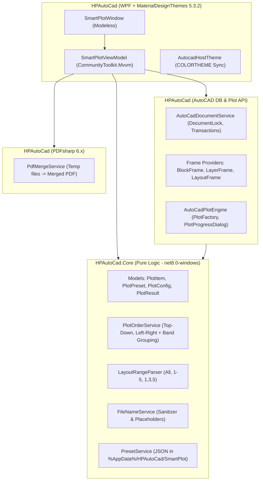

# Smart Plot Pro for HPAutoCad — Implementation Plan

**Date**: 2026-09-20  
**Type**: Feature Implementation  
**Status**: Ready to Execute  
**Ecosystem**: HPAutoCad (AutoCAD 2026, .NET 8.0-windows, C# 12, MaterialDesignThemes 5.3.2)

---

## Executive Summary

Smart Plot Pro is a batch plotting subsystem integrated into the `HPAutoCad` ecosystem. It detects drawing frames from Blocks (standard & dynamic), Layers (closed polylines), or Layouts (tab order & ranges); sorts them in natural reading order (top-to-bottom, left-to-right with tolerance grouping); configures Plot settings via the native AutoCAD Plot API (no `-PLOT` script strings); and produces either individual sanitized PDFs or a merged multi-sheet PDF via PDFsharp (net8). The UI is built with WPF Material Design, runs modelessly with active document locking, and synchronizes dynamically with AutoCAD's `COLORTHEME` (dark/light).

---

## Context & Constraints

- **Host Repository**: `HPAutoCad` within `01_AddinRebar`.
- **Target Runtime**: .NET 8.0-windows, C# 12, `AutoCAD.NET` [25.1.0] (AutoCAD 2026).
- **Isolation & BAML Rule**: `MaterialDesignThemes` 5.3.2 is repacked directly into `HPAutoCad.dll` via `RepackMaterialDesign` ILRepack target to prevent ALC type collision.
- **Theme Binding**: Respects `AutocadHostTheme.Instance` (listening to `COLORTHEME` 55 vs 245), merging `MaterialBridge.xaml`.
- **Plot Engine Contract**: Must strictly use `PlotSettings` -> `PlotSettingsValidator` -> `PlotInfo` -> `PlotInfoValidator` -> `PlotEngine`, guarded by `DocumentLock` and restoring `BACKGROUNDPLOT` & `CMDECHO`.

---

## Architecture & Module Organization

---

## Implementation Phases

### Phase 1: Core Models, Domain Logic & Unit Tests (`HPAutoCad.Core`)
**Scope**: Pure business logic, zero dependency on `Autodesk.AutoCAD.*`.
- [ ] Add domain models in `HPAutoCad.Core/SmartPlot/Models/`:
  - `PlotItem.cs` (`Bounds`, `LayoutName`, `DisplayName`, `AttributeValue`, `Order`, `Rotation`).
  - `PlotPreset.cs` (`Printer`, `PaperSize`, `PlotStyle`, `Orientation`, `SourceType`, `BlockName`, `LayerName`, `LayoutRange`, `NamingRule`).
  - `Enums.cs` (`FrameSourceType`, `OutputMode`, `OrientationMode`).
- [ ] Implement `IPlotOrderService` in `HPAutoCad.Core/SmartPlot/Services/PlotOrderService.cs`:
  - Sort top-to-bottom, left-to-right with tolerance band for Y-overlap.
- [ ] Implement `LayoutRangeParser.cs`:
  - Parses `All`, `1-5`, `1,3,5`, `1-3,5,8-10`.
- [ ] Implement `IFileNameService` in `HPAutoCad.Core/SmartPlot/Services/FileNameService.cs`:
  - Clean invalid characters via `Path.GetInvalidFileNameChars()`.
  - Placeholder formatting (`{Prefix}_{Layout}_{Title}_{SheetNo}`).
- [ ] Implement `IPresetService` in `HPAutoCad.Core/SmartPlot/Services/PresetService.cs`:
  - JSON serialization to `%AppData%\HPAutoCad\SmartPlot\presets.json`.
- [ ] Implement xUnit v3 tests in `HPAutoCad.Tests/SmartPlot/`:
  - `PlotOrderServiceTests.cs`, `LayoutRangeParserTests.cs`, `FileNameServiceTests.cs`, `PresetServiceTests.cs`.

### Phase 2: Frame Detection & Document Services (`HPAutoCad/SmartPlot/Cad`)
**Scope**: Reading drawing database, block references, closed polylines, and layout tabs.
- [ ] Implement `IFrameProvider` interface and implementations:
  - `BlockFrameProvider.cs`: Detects dynamic & standard blocks, reads extents and title block attributes.
  - `LayerFrameProvider.cs`: Detects closed `Polyline`, `Polyline2d`, `Polyline3d` on specified layer.
  - `LayoutFrameProvider.cs`: Enumerates layouts by `TabOrder` filtered by parsed range.
- [ ] Implement `AutoCadDocumentService.cs`:
  - Thread-safe document locking, active document validation, coordinate transformations (UCS to WCS).

### Phase 3: Native AutoCAD Plot Engine (`HPAutoCad/SmartPlot/Cad/Plot`)
**Scope**: Hardware device enumeration, plot configuration validation, and execution pipeline.
- [ ] Implement `PlotDeviceService.cs`:
  - Query available PC3/system printers, canonical media names, and CTB/STB styles via `PlotSettingsValidator`.
- [ ] Implement `AutoCadPlotEngine.cs`:
  - Validate settings with `PlotInfoValidator`.
  - Execute batch plot loop with `PlotFactory.ProcessPlotState.CreatePlotEngine()`.
  - Display and update `PlotProgressDialog`.
  - Guard system variables `BACKGROUNDPLOT=0` and `CMDECHO=0`, restoring on completion/exception.
  - Support `CancellationToken` for user aborts.

### Phase 4: PDF Merge Pipeline (`HPAutoCad/SmartPlot/Pdf`)
**Scope**: Combining generated sheets into a single document.
- [ ] Add `PdfSharp` (v6.x net8) dependency in `HPAutoCad.csproj`.
- [ ] Implement `IPdfMergeService` / `PdfMergeService.cs`:
  - Collect temporary single-page PDFs.
  - Merge into a destination file with bookmarks matching `PlotItem.DisplayName`.
  - Clean up intermediate files safely.

### Phase 5: Material Design WPF UI & MVVM (`HPAutoCad/SmartPlot/UI`)
**Scope**: Modern user interface matching HPAutoCad design language.
- [ ] Implement `SmartPlotViewModel.cs`:
  - Commands: `RefreshFramesCommand`, `PickFrameCommand`, `PlotCommand`, `SavePresetCommand`, `LoadPresetCommand`.
  - Properties: `ProgressValue`, `StatusMessage`, `IsBusy`, `PlotItems`, `Presets`.
- [ ] Implement `SmartPlotWindow.xaml`:
  - Modeless window (`ShowModelessWindow`).
  - Cards: Frame Source, Printer & Paper, Plot Style, Orientation, Output & Naming.
  - Theme sync: Wire `AutocadHostTheme.Instance` to `MaterialThemeBridge.Apply(this, dark, icon)`.
  - Progress bar with sheet status (`12 / 50 sheets`).

### Phase 6: Commands, Ribbon Integration, Build & Live Verification
**Scope**: Assembly repack, command registration, and testing.
- [ ] Implement `SmartPlotCommands.cs` with `[CommandMethod("HPSMARTPLOT")]` and `[CommandMethod("HPLOT")]`.
- [ ] Add "Smart Plot Pro" button to Ribbon panel "Plot" on `HPAUTOCAD_MCP_TAB` in `HPAutoCad.Loader`.
- [ ] Verify `RepackMaterialDesign` merges dependencies without loose DLL collision.
- [ ] Run test suite (`dotnet test HPAutoCad.Tests`).
- [ ] Build solution (`dotnet build HPAutoCad/HPAutoCad.slnx -c Debug`) and verify bundle deployment to `%AppData%\Autodesk\ApplicationPlugins\`.
