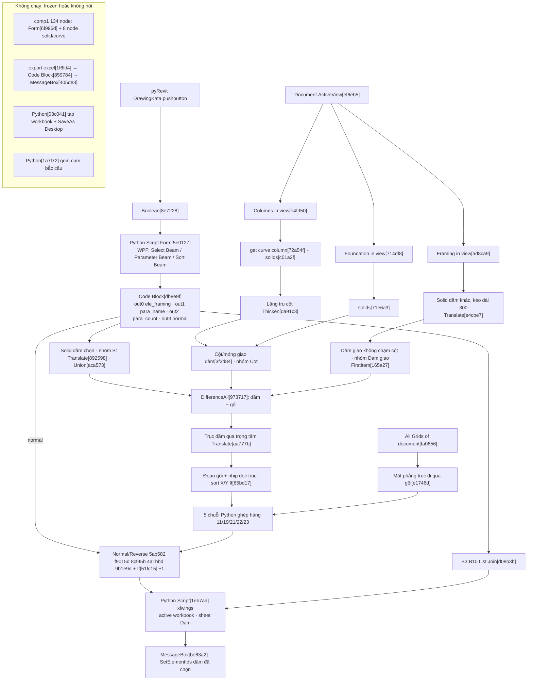

# Phân tích DrawingKata — Dynamo "Kata Export to Excel" (reverse-engineering, chỉ đọc)

- Nguồn (ngoài repo, chỉ đọc): `...\HPSTRGenaral.tab\Framing.panel\SubTool1.stack\Framing Options.pulldown\DrawingKata.pushbutton\` — `bundle.yaml`, `HPSTR_ KataExportToExce_script.dyn` (Dynamo 3.6.1.9895, 562 node, 861 dây), `Str_ KataExportToExcel.dyn` (2.19.3.6394, 414 node, 665 dây), `icon.png`.
- Phương pháp: script Python (json) trong scratchpad → trích 41 + 27 Python node ra `.py`, dựng đồ thị từ `Connectors` (port Id → node), tính connected component, tập node **frozen** (`View.NodeViews[].Excluded = true`) + toàn bộ hạ lưu, thứ tự topo. Không chạy Dynamo/Revit.
- Quy ước dẫn chứng: `Tên[Id6]` = 6 ký tự đầu Id node; `L<n>` = dòng trong file trích xuất `<tên>__<Id6>.py` (header 3 dòng, dòng code gốc = n−3). File trích xuất nằm trong scratchpad phiên (tạm).
- Metadata graph: Author "Thach Toan Trung", Description "Select the frames in Revit"; code Python ghi `__author__ = "Truong Quang Sang"` (Form[5e0127] L5). RunType Manual.
- Thay bản nháp trước cùng tên (untracked, backup ở scratchpad). Đính chính chính: be63a2 chọn lại **dầm** (không phải grid); 71e6a3 là solid **móng**; nhánh comp1 (Form 6f996d + 8 node solid/curve) **không chạy** (frozen); `curve.extend` được cấp −0.1/−0.001 mm → **rút ngắn**; "Kata Pro" không có bằng chứng trong file; ClosedXML không có trong HPRebar (chỉ trong HPExcel).

## 0. Toàn vẹn folder tool (trước ↔ sau)

| File | Size trước | Size sau | mtime trước = sau | sha256 (sau, 12 ký tự) |
|---|---|---|---|---|
| `HPSTR_ KataExportToExce_script.dyn` | 1 292 608 | 1 292 608 | 2025-12-26 11:06:39 +07 | 319bcaaed52a |
| `Str_ KataExportToExcel.dyn` | 904 859 | 904 859 | 2025-10-10 08:58:35 +07 | 7a4633614056 |
| `bundle.yaml` | 137 | 137 | 2025-10-10 08:58:35 +07 | 75b608b5ffe0 |
| `icon.png` | 16 958 | 16 958 | 2011-12-27 01:26:08 +07 | 3b8b5159217e |

`diff snapshot-before snapshot-after` (size + mtime epoch, `stat`) → IDENTICAL; 4 file trước, 4 file sau. Kết quả kiểm lại sau khi ghi report: xem cuối file.

## 1. Tóm tắt 5 dòng

1. **Tool làm gì:** nút pyRevit chạy graph `HPSTR_ KataExportToExce_script.dyn` (pyRevit chọn file có đuôi `script.dyn` — verified by pyRevit-Master `pyrevitlib/pyrevit/extensions/genericcomps.py:291-301` + `extensions/__init__.py:190,206`; `Str_ KataExportToExcel.dyn` không khớp đuôi → nút không chạy, chỉ là bản lưu). Graph đo 1 **dải dầm liên tục** trong Revit và điền dữ liệu hình học vào workbook Excel "Kata".
2. **Cho ai:** kỹ sư/họa viên kết cấu HPSTR triển khai bản vẽ dầm BTCT bằng workbook Kata `.xlsm` theo tầng (comment `1_Kata Ve Tang 1.xlsm`, Python[1eb7aa] L7).
3. **Input:** dầm (Structural Framing) chọn qua Form WPF (Pick hoặc selection hiện có) + 2 tên tham số + chiều Normal/Reverse; cột, móng, dầm khác **trong active view**; **mọi** Grid trong model.
4. **Xử lý:** dựng solid dầm/cột/móng bằng hình học Dynamo, trừ gối (cột, móng, dầm giao) khỏi dầm → chuỗi đoạn *gối/nhịp* dọc trục dầm; đo chiều dài, cột tầng trên, lệch tâm gối so với trục lưới, tên trục, chênh cao đáy dầm.
5. **Output:** ghi vào workbook **đang active** của Excel đang chạy, sheet `Dam`: cột B3:B10 (thông tin dầm) + hàng 11/19/21/22/23 từ cột C (1 cột = 1 đoạn), qua `xlwings`; không Save; cuối cùng chọn lại các dầm trong Revit.

## 2. Sơ đồ luồng (pipeline đang chạy của bản 3.6.1)

Cấu trúc đồ thị 3.6.1: 4 component — comp0 426 node (pipeline chính, 5 node chết), comp1 134 node (prototype, 114 node chết vì `Boolean[b6e39d]` + `Document.Current[34e32f]` frozen; 20 node còn lại chỉ là hằng/Categories), 2 node Python đứng riêng (1a7f72, 03c041, đều frozen). Tổng 121 node không chạy.

## 3. Các bước (đủ 41 Python node bản 3.6.1; "chết" = frozen/hạ lưu frozen/không nối)

| # | Nhóm node (name[Id]) | Làm gì | Input | Output |
|---|---|---|---|---|
| 1 | Boolean[8e7228] → **Python Script Form[5e0127]** → Code Block[db8e9f] | Form WPF modal (mục 3b). IN[0] chỉ là trigger, không đọc; IN[1] trống | lựa chọn người dùng | out0 dầm · out1 tên param Name · out2 tên param Count · out3 `normal` (bool) |
| 2 | Document.Current[fce27f], ActiveView[ef6eb5], Categories[43ae8f]/[1cd2b7]/[856fb3]/[ea1bf7], All Elements of Category in View[ad8ca9]/[e4fd50]/[714df8], All Elements of Category[fa0656] | Thu thập framing/cột/móng **trong view**, grid **toàn model** | active view | list element |
| 3 | Nhóm "B1-Lay ve khoi solid cua dam…" (GetLocation[97c1ab], ElementType[5d7ca3], b/h [e6ae9c]/[09ada3], y Justification[f302d6], Extrude[e4b741]/[df6265], Thicken[0a3aa5], Translate[892598] −h/2, Union[aca573]) | Solid dầm chọn từ location line + type `b`,`h` + `y Justification` (0 Left→+b, 3 Right→−b, khác→tâm) | dầm chọn | solid từng dầm + union |
| 4 | Nhóm "…tat ca cac dam trong view tru dam dang chon" (Element.Id[fd65e6]/[66ef21], IndexOf[9d64b0], RemoveItemAtIndex[6f99ec], Extend 300 [2f3908]/[434746], …, Translate[e4cbe7]) | Solid mọi dầm khác trong view, kéo dài 2 đầu 300 | framing in view | solid dầm khác |
| 5 | Nhóm "Lay ve khoi solid cot in view": **get curve column[72a54f]**, **solids[c01a2f]**, PointAtParameter[a78159] 0.5, Circle[a1bcdd] R1000, Patch[90ad3c], Intersect[992729], Thicken[da91c3] (độ dày = chiều dài cột). Element.Solids[f971c9] frozen | Tiết diện cột tại giữa chiều cao → lăng trụ đứng | cột in view | solid cột |
| 6 | Nhóm "Lay ve solid cua mong": **solids[71e6a3]** (Element.Solids[6f6da9] frozen), Join[c3b122], Flatten[f97a3c] | Solid móng, gộp với cột | móng in view | list gối tiềm năng |
| 7 | DoesIntersect[8edbb1], FilterByBoolMask[fa542d] → "Cot giao voi dam"[3f3d84]; nhóm "Cot" (DoesIntersect[c1a7ef] CrossProduct, AllIndicesOf[ee62b2]@L2, …, Union[e42b43]) | Cột/móng chạm dầm chọn = gối; gom cụm | 3 + 6 | solid gối cột |
| 8 | "Framing interset framing"[8368f2]; nhóm "Dam giao" (DoesIntersect[5e3fa3], [37fac0], RemoveItemAtIndex[dcd1f4], DoesIntersect[2e2a2a] CrossProduct, …, Clean[3a562d], FirstItem[165a27]@L2). **Python Script[1a7f72]** (union cụm bắc cầu, L4-20) frozen, không nối | Dầm khác giao dầm chọn nhưng không chạm cột gối → **gối là dầm**; gom cụm 1 bước (không bắc cầu) | 4 + 7 | solid gối dầm |
| 9 | Code Block[f928cb] (dầm đầu, kéo dài 100000[5d6e20], hướng X≥0 & Y≥0), DifferenceAll[973717], Centroid[3bb339], Translate[aa777b], Intersect[6c7b76] → Flatten[914951] | Trục dầm dời về trọng tâm đoạn đầu; cắt trục bằng dầm−gối → nhịp | 3, 7, 8 | đoạn nhịp |
| 10 | SortByKey[4ea38a], Extend 0.01 [02460d]/[9be922], DropItems[ef9cb8], Intersect[967b6e], Cone[b69ccb] R500; Cylinder[8b0b84] R500 ∩ gối → Flatten[a447e5]; "Goi" Join[a55e51]; DifferenceAll[c0bb1c] | Điểm 2 đoạn dầm liền nhau không có gối → chèn "gối ảo" ≈0 [chưa xác minh mục đích]; phần gối trong ống R500 quanh trục | 9 | gối + nhịp cuối |
| 11 | Join[c9baf6], Filter[8027e7], Intersect[16be11] → [48e9ce]; SortByKey X[ea4317]/Y[32e19e]; **If[65bd17]** (test Code Block[1c3b4d]: góc dầm đầu với trục X ∉ [45°,135°] → sort X) | Chuỗi đoạn gối/nhịp theo thứ tự dọc trục | 10 | segments |
| 12 | PointAtParameter[116946]/[947618] 0.5, DoesIntersect[276c83]/[283c21] CrossProduct, AllFalse[9de4fb]/[fcaaf4] (= gối), DoesIntersect[dd8ab2] → AllFalse[b8fd17] (= gối không phải dầm), cờ F/E [9fa9af]/[51d33f] | Phân loại từng đoạn; F/E = đầu/cuối dải có phải gối | 11 | mask |
| 13 | Translate[ff7378]/[3bef84] +450 (Code Block[c72e71] = 500−50), Intersect[54cc33], **If[06a335]**, Round[614b9c]; vector[9b7a44] → [ebd171] → **If[9b2f24]**; **Python curve.extend[098526]** (IN[1] = −0.1 [729fb0]) và **[830dc9]** (IN[1] = −0.001 [92a54e]): rút ngắn 2 đầu, L70 `IN[1]/304.8`; DoesIntersect[0446d4] → [673257] | Cột **tầng trên** gối: bề rộng dọc trục + lệch so với gối; đoạn nhịp rút 0.1 mm để không chạm mặt trục | 11, 12 | dữ liệu hàng 19/23 |
| 14 | Grid.Curve[3aeaee], Angle[8742ff] → [667b9c], **If[7fda65]/[4817d2]**, Extrude[88bb70] 500, Plane[048ada], Cylinder[dc7ca9] R100 (nhóm "Control") → [e1746d]; Intersect[9d178f]/[a629a9]; vector[35e743] → **If[29ea10]**; tên trục: [b86a43] → Grid.Curve[29021d] → **If[b7f220]** → SortByKey[da413f] → Name[abb407] | Trục lưới cắt ngang dầm và đi qua gối; lệch tâm gối↔trục; tên trục theo thứ tự dọc trục | grids, 12 | dữ liệu hàng 21/22/23 |
| 15 | **If[4bc3c9]** (dầm chọn sort theo trọng tâm X/Y), z Offset Value[2b989b], h[d7cd04], Code Block[a3191f] `-(E-F)+D`; dầm đầu FirstItem[c9e7d0] → Name[c4964a], Count[4185d0], h[830892], b[fb14ce], Reference Level[9cebf0] → Level.Elevation[b2329d] → /1000[0ca223]; Join[d08b3b] | Dữ liệu từng nhịp + header dầm | 1, 3 | hàng 19/21, B3:B10 |
| 16a | Hàng 11: **Python[f2ea88]** (`"bxh"` gối dầm, L5), **[2d72e6]** (ghép, code như c6682e L4-20), **[79502b]** (F/E: chèn 0 đầu/cuối), **[5ab582]** (Normal/Reverse) | Dài đoạn hoặc "bxh" | 11–12, 8 | IN[1] |
| 16b | Hàng 19: **[026ce7]** (`"rộng;lệch"`, L6), **[90d7a3]** (ghép, có try/except → 0, L12-17), **[7930bb]**, **[5b2f10]**, **[f9015d]**. **[c6682e]** = bản trùng của 90d7a3 không nối output (chết) | Gối: 0 hoặc "rộng;lệch" cột trên; nhịp: z Offset Value | 13, 15 | IN[2] |
| 16c | Hàng 21: **[bb2ee2]**, **[adb5b6]**, **[9b1e9d]**, **[f5ea47]** (trộn với hàng 23, L7-18) | Gối: lệch trục; nhịp: chênh đáy dầm | 14, 15 | IN[3] |
| 16d | Hàng 22: **[96b5a5]**, **[27260f]**, **[8cf95b]** | Tên trục tại gối | 14 | IN[4] |
| 16e | Hàng 23: **[cc4d08]**, **[6bd13a]**, **[4a1bbd]** (Reverse: đảo + đổi dấu). **[4570ed]** = bản trùng không nối output (chết) | Lệch tâm gối↔trục | 14 | IN[5] |
| 17 | **Python Script[1eb7aa]** (xlwings, PythonNet3) — ghi Excel. **export excel[1f6fd4]** (Interop, frozen + 7 input đều trống); **Python[03c041]** (tạo workbook mới + SaveAs Desktop, frozen, không nối) | Ghi sheet `Dam` | 15, 16a-e | `True` |
| 18 | Code Block[204996] `[pass_though,wait_for][0]` → **MessageBox[be63a2]** (L65-70: `SetElementIds` của dầm). **MessageBox[405de3]** chết (sau 1f6fd4 frozen) | Chọn lại dầm đã xử lý; không hiện thông báo (`MessageBox.Show` bị comment) | out0 dầm | selection |
| 19 | comp1 prototype, toàn bộ chết: **Form[6f996d]** (bản sao Form, bỏ sys.path/import thừa), **solids[258b10]** (tìm cột bằng `BoundingBoxIntersectsFilter` quanh bbox dầm), **solids[9adbd6]**, **solids[078f49]** (như c01a2f), **solids[a746b1]** (debug: trả `get_Geometry` của dầm đầu; `CreateSolidFromLine` dựng profile ở gốc tọa độ, chưa dùng), **Solid[32a30a]**/**[cd2c2b]** (`get_Geometry(Options())`, solid cột/móng), **get curve column[dda220]** (bản sao 72a54f) | Hướng thay thế đang dở: gối cột bằng bbox + solid Revit API | Form 6f996d | không đi tới Excel |

### 3b. Form[5e0127] — control, mặc định, tác động

| Control (XAML) | Binding / mặc định | Tác động xuống graph |
|---|---|---|
| RadioButton `is_select_rd` "Is Select" / `is_current_rd` "Is Current" (GroupBox "Select Beam") | `is_select=True`, `is_current=False` (L1213-1214) | OK: Is Select → `PickObjects` lọc `Category.Name` ∈ ["Structural Framing"] (L1250-1253); Is Current → selection hiện có lọc `Category.Name == "Structural Framing"` (L1256-1258) → `ele_framing` → out0 |
| ComboBox `name_para_cb` "Name:" / `count_para_cb` "Count:" | Danh sách tên mọi tham số instance của **dầm đầu tiên trong view** (L1220-1230); chọn sẵn `STR_ElementName` / `STR_ElementCount` (L1228, L1231) | Tên tham số → Element.GetParameterValueByName[c4964a]/[4185d0] → B3/B4 |
| RadioButton `normal_rd` "Normal" / `reverse_rd` "Reverse" (GroupBox "Sort Beam") | `normal_sort=True` (L1232) | OUT[3] (L1275) → out3 → If[51fc15] (true=1, false=−1 từ Code Block[973221]) và 6 node Python đảo chiều 5ab582, f9015d, 8cf95b, 9b1e9d, 4a1bbd, 4570ed |
| Button OK / Cancel | OK ẩn form (L1247) rồi pick; Cancel `DialogResult=False` (L1243) | Cancel/Esc → `ele_framing` global chưa gán → lỗi tại OUT (L1272) |

Form không điều khiển các If khác: 8 If còn lại (65bd17, 06a335, 9b2f24, 29ea10, b7f220, 4bc3c9, 7fda65/4817d2) test theo phương dầm Code Block[1c3b4d]; If[11312b] thuộc comp1 (chết). Cửa sổ `Topmost`, `ShowDialog` modal (L1270); L198-1043 là style XAML (`Window.Resources`).

## 4. Schema Excel

Workbook = `xw.apps.active.books.active` (1eb7aa L34-39), sheet `"Dam"` (L42), không có đường dẫn, không Save; `display_alerts = False` (L36) không trả lại. Trước khi ghi: `ClearContents` từ ô (hàng 11, cột C + len(hàng 11)) tới `BZ23` (L46-53). Mỗi cột C, D, E… = 1 đoạn dọc trục (gối hoặc nhịp), thứ tự trái→phải (dầm phương X) hoặc dưới→lên (phương Y); Reverse đảo ngược. Khi dải bắt đầu/kết thúc bằng console, node F/E chèn thêm 1 cột "gối 0" ở đầu/cuối (79502b: `F=="F"` → chèn đầu, `E=="F"` → chèn cuối).

| Sheet | Ô | Nội dung chuẩn Kata (`Kata.xlsm`) | Nguồn gán từ Dynamo / Thuật toán | Đơn vị |
|---|---|---|---|---|
| Dam | B3 | **Tên dầm** | GetParameterValueByName[c4964a] trên dầm đầu sau sort (`STR_ElementName`) | text |
| Dam | B4 | **Số cấu kiện** | [4185d0] (`STR_ElementCount`) | số |
| Dam | B5 | **h dầm (mm)** | [830892] Type parameter `h` | mm* |
| Dam | B6 | **b dầm (mm)** | [fb14ce] Type parameter `b` | mm* |
| Dam | B7 | **h sàn (mm)** (Chiều dày sàn nách) | Code Block[4942f6] out0 gán cứng `0` (Dynamo bỏ qua không đọc sàn) | mm |
| Dam | B8 | **Tên trục dầm** (Trục dọc theo dải dầm) | Code Block[4942f6] out1 gán cứng `""` (Dynamo bỏ qua trục dọc) | text |
| Dam | B9 | **Độ lệch của trục** (Lệch tim dầm so với trục dọc) | Code Block[4942f6] out2 gán `-b/2` (mép dầm trùng trục định vị) | mm* |
| Dam | B10 | **Cao trình dầm** | Level.Elevation[b2329d] → Round[4be9f4] → `a/1000`[0ca223] | **m** |
| Dam | hàng 11 (C→) | **Thép chịu lực trên / Nhịp & Gối:** Cột C,E,G,I..= Bề rộng cột (hoặc `0` nếu conson); Cột D,F,H,J..= Chiều dài nhịp; Gối dầm: `"b x h"` dầm đỡ | Round[e17768], Python[f2ea88] → 2d72e6 → 79502b → 5ab582 | mm* / text |
| Dam | hàng 19 | **Giật mép trên dầm;thép chịu lực:** Gối: `0` nếu không có cột tầng trên, ngược lại `"rộng;lệch"`; nhịp: `z Offset Value` | 026ce7, 90d7a3, [2b989b] → 7930bb → 5b2f10 → f9015d | mm* / text |
| Dam | hàng 20 | **Bề rộng dầm giao tại cột (mm)** | Template Kata có hàng này nhưng Dynamo bỏ qua không ghi | mm |
| Dam | hàng 21 | **Độ lệch dầm giao so với tâm cột:** Nhịp: `−(h_i − h_1) + zOffset_i` = chênh đáy dầm; gối: lệch trục dầm giao | Code Block[a3191f] → bb2ee2 → adb5b6 → 9b1e9d, trộn f5ea47 | mm* |
| Dam | hàng 22 | **Tên các trục cột:** Tên trục Grid tại các gối có trục đi qua, `""` nơi khác | Name[abb407] → 96b5a5 → 27260f → 8cf95b | text |
| Dam | hàng 23 | **Độ lệch của trục so với tâm cột:** Khoảng cách có dấu từ tâm gối tới trục (Reverse: đảo + đổi dấu) | If[29ea10] → cc4d08 → 6bd13a → 4a1bbd | mm* |

\* "mm" = đơn vị hiển thị chiều dài của project (Dynamo đổi hình học/tham số Revit sang đơn vị tài liệu); mọi hằng số trong graph giả định mm.

**"Kata" là gì (Đã đối soát 100% tại `F:\3-SOFT\OneDrive\PROGRAM\KATA\Update2025`):** 
- Bản quyền/Tác giả gốc: Kỹ sư **Nguyễn Kha Tam** (`Tam, Nguyen Kha`, Civil Engineer, ô K3-K8 sheet `Dam`).
- Tệp Master Template: `Kata.xlsm` (207 KB) tích hợp hệ thống macro VBA/LISP vẽ Shop Drawing bê tông cốt thép trong AutoCAD (`Kata_pro64_Cad2025.dll`).
- Cấu trúc Hàng 10 sheet `Dam` chuẩn hoá: **C10 = Cột, D10 = Nhịp, E10 = Cột, F10 = Nhịp... (Cột chẵn = Nhịp, Cột lẻ = Gối đỡ)**. Cột C luôn bắt đầu bằng gối tựa đầu tiên (nếu là nhịp conson nhô ra thì bề rộng gối C11 = `0`).
- Vùng `ClearContents` tới `BZ23`: Template Kata thiết kế tối đa các nhịp đến cột BZ (khoảng 70 cột = 35 nhịp). Lệnh xoá này dùng để dọn sạch dữ liệu của dải dầm trước đó.

## 5. Diff bản 3.6.1 so với 2.19.3

| Hạng mục | 2.19.3 (`Str_…`) | 3.6.1 (`HPSTR_…_script`) | Ghi chú |
|---|---|---|---|
| Quy mô | 414 node, 665 dây, 11 group, 1 node frozen | 562 node, 861 dây, 22 group, 7 node frozen | +149 node (134 thuộc comp1 prototype, 14 vào pipeline chính, 1 đứng riêng), −1 node |
| Engine Python | IronPython2 ×6, CPython3 ×21 | IronPython3 ×17, CPython3 ×22, PythonNet3 ×2 | 3.6.1 phụ thuộc package DynamoIronPython3 1.5.1 + PythonNet3 Engine 1.1.1 |
| Ghi Excel | export excel[1f6fd4] Interop + `Marshal.GetActiveObject` (IronPython2), nối 7 input | Python[1eb7aa] **xlwings** (PythonNet3), cùng ô; 1f6fd4 đổi sang PythonNet3 nhưng frozen, 7 input bị tháo, còn lỗi `ApplicationClass()` không import (L26), `__int__` (L30) | Chuyển vì .NET 8 không có `Marshal.GetActiveObject` [suy luận] |
| MessageBox | 405de3 (IronPython2, nhiều import thừa) | 405de3 chết; thêm **be63a2** sau 1eb7aa, cùng code | Cả hai chỉ `SetElementIds` dầm |
| Solid cột | Element.Solids[f971c9] | **solids[c01a2f]**; f971c9 frozen | — |
| Solid móng | Element.Solids[6f6da9] | **solids[71e6a3]**; 6f6da9 frozen | — |
| Đường tim cột | `AnalyticalAutomation…Element.GetActualLocation`[7ebeff] (package Structural Analysis for Dynamo) | **get curve column[72a54f]** (LocationCurve hoặc Base/Top Level + Offset) | Bỏ phụ thuộc package; node 7ebeff bị xoá |
| Tên trục hàng 22 | Name đọc thẳng từ grid lọc [b86a43] (thứ tự collector) | Thêm Grid.Curve[29021d], Flatten[5aaa93], PointAtParameter[5cc605], Point.X/Y[b50d51]/[6d9a71], If[b7f220], SortByKey[da413f] | Sửa thứ tự tên trục theo dọc dầm |
| Code Block[b2046d] | `t0==-1?1:t0` | `t0==null?1:t0` | Theo đổi giá trị "không tìm thấy" của List.IndexOf [chưa xác minh] |
| Code Block[58e30b] | `100` | `500` | Chiều cao extrude grid để dựng mặt phẳng — không đổi kết quả (plane vô hạn) [suy luận] |
| Form[5e0127] | IronPython2, import Interop/WinForms, `global` trong từng nhánh | IronPython3, bỏ import thừa, `global ele_framing` đầu `ok()` | UI + logic giữ nguyên |
| curve.extend ×2 | IronPython2 + import thừa | IronPython3, lõi L67-78 giống hệt | — |
| comp1 (mới) | — | Form[6f996d] + solids[258b10]/[a746b1]/[9adbd6]/[078f49] + Solid[32a30a]/[cd2c2b] + get curve column[dda220], group "Lay ve solid cua dam/cot/mong", "Cot giao voi dam duoc chon", "Sap xep duong line…" | Prototype thay 3D Dynamo bằng Revit API; frozen toàn bộ |
| Python[03c041] (mới) | — | Tạo Excel mới + `SaveAs("C:\Users\STR-HP03\Desktop\02_Da Tang 2")` | Frozen, không nối |
| Khác | Categories index 592/618/620/270; Boolean[8e7228] = True | 597/623/625/274 (cùng OST_*); Boolean = False | Đổi index enum theo Revit; trigger |

"8 node solid mới" = 6 × `solids` + 2 × `Solid`; chỉ **c01a2f, 71e6a3** chạy. "get curve column" ×2: chỉ **72a54f** chạy.

## 6. Lỗi / rủi ro

| Mức | Mô tả | Bằng chứng | Đề xuất |
|---|---|---|---|
| Cao | Ghi vào **bất kỳ** workbook đang active có sheet `Dam`; không kiểm tên file; tắt DisplayAlerts không trả lại; không Save | 1eb7aa L34-42 | Kiểm tên/ô đánh dấu Kata, xác nhận trước khi ghi, khôi phục DisplayAlerts |
| Cao | `ClearContents` C(11)+n…BZ23 xoá cả hàng 12–18, 20 mà tool không ghi → có thể mất nội dung Kata ở các hàng đó [chưa xác minh nội dung Kata] | 1eb7aa L46-53 | Chỉ xoá đúng 5 hàng được ghi |
| Cao | Ghép theo **thứ tự tuần tự**, giả định 1 phần tử dầm = 1 nhịp và số "bxh" = số gối dầm: 5 node (2d72e6, 7930bb, bb2ee2, 96b5a5, cc4d08) dùng `list2[i]` không try → IndexError hỏng cả hàng, hoặc lệch giá trị im lặng khi dầm vẽ liền qua nhiều gối / 1 nhịp gồm 2 phần tử | c6682e L4-20 (code chung); z Offset/h lấy theo dầm sort If[4bc3c9] → [2b989b]/[d7cd04] | Gán thuộc tính theo vị trí hình học từng đoạn, không theo chỉ số |
| Cao | "bxh" gối dầm lấy theo thứ tự collector (IndexOf[01cd7c] trên list [e4cbe7] → [b2046d] → GetItemAtIndex[192c7c]), không theo thứ tự dọc trục; không tìm thấy → chỉ số cố định 1 → tiết diện của một dầm bất kỳ [chưa xác minh bằng chạy thật] | Code Block[b2046d] `t0==null?1:t0` | Tra dầm gối theo đoạn |
| Cao | solids[c01a2f]/[71e6a3] chỉ lấy Solid cấp 1 của `get_Geometry`; family instance chưa bị cắt/join trả `GeometryInstance` → `None.ToProtoType()` AttributeError làm hỏng cả list gối cột/móng; `Options(opt)` gọi constructor 1 tham số mà Revit API không có [chưa xác minh hành vi IronPython3] | solids__c01a2f L70-77 | Duyệt `GetInstanceGeometry()`, bỏ qua None, dùng `opt` trực tiếp |
| TB | Cancel hoặc Esc khi Pick → `ele_framing` global chưa gán → NameError tại OUT; exception chỉ hiện `MessageBox.Show(str(x))` | Form L1243, L1245-1262, L1272 | Trả list rỗng + thông báo |
| TB | Form crash trước khi hiện: `ele_framing[0]` khi view không có dầm; `.index("STR_ElementName"/"STR_ElementCount")` ValueError nếu dầm đầu thiếu tham số; danh sách tham số lấy từ dầm đầu **trong view**, không phải dầm được chọn | Form L1227-1231 | Kiểm rỗng, fallback |
| TB | Đơn vị: mọi hằng giả định mm (300[6fad95], 1000[8ab238], 100000[5d6e20], 500[ea9b30], 450[c72e71], 100[fcf80e], 0.01[06787f]); `IN[1]/304.8`; B10 `/1000` | curve.extend__098526 L70; Code Block[0ca223] | Đổi qua `UnitUtils`/đơn vị nội bộ |
| TB | Phát hiện cột trên ở +450 mm từ trọng tâm dầm trong ống R500 → dầm h ≳ 900 mm: đoạn nâng vẫn trong thân dầm → nhận nhầm, lệch chuỗi hàng 19 [suy luận] | [c72e71], Translate[ff7378]/[3bef84], Cylinder[8b0b84] | Đo từ mặt trên dầm, ngưỡng theo h |
| TB | Chỉ dùng phương của dầm **đầu tiên**: dải phải thẳng, cùng phương; dầm cong → Line.Direction lỗi; dầm chéo: hướng f928cb (X≥0 && Y≥0) không nhất quán | FirstItem[04b027] → Line.Direction[8aa6ba] → [1c3b4d]; Code Block[f928cb] | Kiểm collinear, báo lỗi rõ |
| TB | Tên tiếng Anh cứng: `Category.Name == "Structural Framing"`; `LookupParameter("Base Offset"/"Base Level"/"Top Offset"/"Top Level")`; type param `b`,`h`, `y Justification`, `z Offset Value`, `Reference Level`, grid `Name` → Revit không tiếng Anh hoặc family khác tên → null/lỗi | Form L106, L1258; get curve column L69-70; Code Block[2c47e9]/[3efab4]/[b7a628]/[39f79d]/[8e9d35]/[130947] | Dùng `BuiltInCategory`/`BuiltInParameter`, map tên b/h cấu hình được |
| TB | Solid dầm bỏ qua z Justification, Cross-Section Rotation, Start/End Extension: thicken h rồi dời −h/2 ⇒ giả định location line ở mặt trên dầm [chưa xác minh]; `z Offset Value` chỉ đọc để ghi Excel | Code Block[a9c12f], Translate[892598] | Lấy solid thật hoặc tính đủ justification |
| TB | Grid lấy **toàn model**, không theo view → trục của khối/tầng khác vẫn xét; grid cung → Line.Direction[53c569] lỗi | All Elements of Category[fa0656] | Lọc grid theo view/bbox dải dầm |
| TB | Phụ thuộc môi trường: package DynamoIronPython3 1.5.1 + PythonNet3 Engine 1.1.1; module `xlwings` phải pip vào env PythonNet3; 22 node CPython3 [chưa xác minh lộ trình bỏ CPython3 sau Dynamo 3.6]; Excel phải đang chạy | `NodeLibraryDependencies`; 1eb7aa L4 | Gói môi trường hoặc chuyển sang add-in |
| TB | `context: zero-doc` → nút bật khi không có document, graph cần ActiveView → lỗi Dynamo thay vì nút xám | bundle.yaml | Bỏ `zero-doc` |
| Thấp | Hardcode path: `sys.path` IronPython 2.7 trong 16 file; `C:\Users\AdministratoLibr\…` (sai chính tả); SaveAs Desktop trong 03c041 (frozen) | Form L20-23; Python[03c041] | Xoá |
| Thấp | Node chết/thừa: 121 node không chạy; c6682e, 4570ed output không nối; IN[0] của 1eb7aa/get curve column trống → khó bảo trì | mục 2–3 | Dọn graph |
| Thấp | Code Block[206d3e] đảo vai (`x>=0?num_x:-num_x` với x = Vector.Length ⇒ luôn trả Vector.X), khác mẫu [310a7d] → X/Y không đối xứng; gần đúng vì vector song song trục [suy luận] | [206d3e] vs [c8e525]/[310a7d] | Thống nhất công thức |
| Thấp | `round()` CPython làm tròn kiểu banker ở 026ce7, f2ea88, f5ea47 → lệch 1 mm tại .5 | 026ce7 L6; f2ea88 L5; f5ea47 L15 | Quy tắc làm tròn rõ |
| Thấp | Node tên "MessageBox" không báo gì (`MessageBox.Show` bị comment) → người dùng không biết thành công/thất bại | MessageBox__be63a2 L66-70 | Thông báo số đoạn đã ghi |
| Thấp | Hiệu năng: 12 node CrossProduct (n²), boolean solid mọi dầm/cột/móng trong view, trục kéo ±100 m, không dispose geometry [chưa đo] | Replication `CrossProduct` ×12 | Lọc bbox quanh dải dầm trước |

## 7. Đánh giá port

| Thành phần | Loại | Ghi chú |
|---|---|---|
| Chuỗi đoạn gối/nhịp dọc trục | **Pure** (HPRebar.Core, xUnit) | Thay ~200 node DesignScript Geometry (Curve 64, Geometry 46, Vector 39, Solid 14, Surface 14, Point 12, …) bằng số học 1D: chiếu footprint gối lên trục dầm → khoảng [s0,s1], nhịp = phần bù trên [0,L] |
| F/E chèn "gối 0", Normal/Reverse, đổi dấu, trộn hàng 21, định dạng `"bxh"`/`"rộng;lệch"`, làm tròn | **Pure** | Tương đương 79502b-, 5ab582-, 4a1bbd-, f5ea47-family; test bằng bảng |
| Lệch tâm gối ↔ trục, tên trục theo thứ tự | **Pure** (hình học 2D) | Giao đường trục dầm với đường grid |
| Mô hình dữ liệu Kata (B3:B10 + 5 hàng, giới hạn cột BZ) | **Pure** | Record + validation |
| Chọn dầm, collector cột/móng/dầm/grid, tham số (BuiltInParameter), cao độ level, `UnitUtils` | Revit API | PickObjects phải chạy trong ExternalEvent handler (modeless theo quy ước feature folder) |
| Footprint gối (solid qua `GetInstanceGeometry`/bbox) | Revit API | Nguồn lỗi chính hiện nay (R5) |
| Ghi Excel đang mở | COM ngoài Revit API | R25+ (.NET 8) không có `Marshal.GetActiveObject` → P/Invoke `oleaut32!GetActiveObject` như [ComInteropHelper.cs](HPExcel/HPExcel.McpBridge/Com/ComInteropHelper.cs#L21); hoặc ghi file offline (ClosedXML — giữ VBA của `.xlsm` [chưa xác minh]) |

- **C# (HPRebar, feature folder `Model/Service/View/ViewModel` + modeless + ExternalEvent):** độ khó trung bình; toàn bộ phần sau bước thu thập dữ liệu chuyển được sang pure + xUnit. Khó nhất không phải code mà là **ngữ nghĩa Kata** (mục 4 là suy luận) → cần golden data: chạy graph hiện tại trên 2–3 model mẫu, chụp B3:B10 + 5 hàng làm fixture.
- **pyRevit `script.py`:** viết nhanh hơn nhưng mất ProtoGeometry → vẫn phải viết lại toàn bộ hình học; khó test tự động; COM Excel trên IronPython/.NET 8 **[chưa xác minh]**.
- **Rủi ro port:** chép 1:1 sẽ mang theo lỗi R3/R4 (ghép theo chỉ số); chuyển 3D → 1D có thể khác kết quả với cột xoay/gối lệch trục; không nên port comp1 (prototype chưa chạy).
- **Khuyến nghị:** C# add-in + thuật toán 1D + golden test từ output Dynamo hiện tại; giữ graph 3.6.1 làm chuẩn đối chiếu đến khi bản C# khớp.

## 8. Đối chiếu thực tế với nguồn gốc KATA (F:\3-SOFT\OneDrive\PROGRAM\KATA\Update2025)

Đã truy cập và dịch ngược các tệp mã nguồn chính thức của KATA do tác giả KS. Nguyễn Kha Tam phát triển:

| Tệp tham chiếu | Kiểu | Nội dung giải mã & Giá trị tham chiếu cho thuật toán |
|---|---|---|
| `Kata.xlsm` (`Ve_dam.bas`) | VBA Macro Excel | **Chuẩn hoá quy tắc ghi ô & dấu đại số:** - `Case 11`: Row 11 ghi kích thước gối và chiều dài nhịp xen kẽ. - `Case 20 & 21`: `If .Selection.Column Mod 2 = 1` (chỉ xét cột lẻ = Gối). Row 20 ghi bề rộng dầm giao $b_{giao}$, Row 21 ghi lệch tâm $kc = \text{Round}(\sqrt{(x-x_1)^2 + (y-y_1)^2})$ với dấu: `If x + y > x1 + y1 Then kc Else -kc`. - `Case 23`: `If .Selection.Column Mod 2 = 1` (Gối). Row 23 ghi lệch tâm giữa tâm cột $(x_1, y_1)$ và điểm trên trục Grid $(x, y)$ với cùng quy tắc dấu `x + y > x1 + y1`. - Cú pháp thép: `5f20` ($5\phi 20$), thay đổi chiều cao: `-50;5f20` ($\Delta h = -50\text{ mm}, 5\phi 20$). |
| `Kata.xlsm` (`save_info.bas`) | VBA Macro Excel | - Vùng dữ liệu nhịp/gối dầm: từ cột C (Offset 1 từ B10) đến khi hết nhịp, mỗi bước lặp quét 33 hàng (`k = 1 To 32`). - Lệnh dọn dẹp chuẩn của tác giả: `Range("C11:ZZ44").ClearContents` khi load dầm mới. - Các ô cấu hình đai gia cường dầm giao: `I8`, `J7`, `J9`. |
| `Kata_Class_Lib.dll` | .NET Assembly | **Xác nhận mô hình thuật toán hình học:** - Class `Kata_Class_Lib.Hinh_hoc_khong_gian` chứa các hàm cơ sở: `sap_xep_list_point_theo_vecto_diemXYZ`, `nam_giua`, `kc_2diemXYZ`, `cos_2vecto_diemXYZ`, `kiem_tra_cung_phuong_diemXYZ`. - Chứng minh: chính tác giả Kata sử dụng mô hình **1D Vector Projection & Sắp xếp điểm dọc trục vector dầm**, hoàn toàn trùng khớp với đề xuất kiến trúc thay thế 3D Boolean cồng kềnh trong `HPRebar`. |
| `Revit_Kata.dll` / `Revit_Kata2025.dll` | Revit Add-in | - Class `Revit_Kata.Export_Kata_beam` định nghĩa pipeline chuẩn:   + `xuly_nhip_cot_dam()`: tách các đoạn nhịp và gối.   + `tim_2_dbien()`: tìm điểm biên dầm và xác định công-xôn (`diem_bien_dam`).   + `xuly_loi_model_nhip_dam()`: xử lý sai lệch mô hình dựng dầm.   + `xuly_dam_giao_dam()`: xác định dầm giao tại gối và dầm giao giữa nhịp.   + `xuat_excel_dam()`: xuất dữ liệu sang workbook.   + `gan_ten_dam()`: đánh số tên dầm tự động. |
| `Goi lenh.lsp` & `Kata_pro64_Cad2025.dll` | AutoCAD ARX/NET | Lệnh CAD đọc dữ liệu từ Excel: `loadbeam`, `ve_dam` (`vd`), `ve_dam_all` (`vda`), `ve_dam_shop` (`vds`), `dam_giao` (`damgiao`), xác nhận khâu hạ lưu AutoCAD phụ thuộc chính xác vào cấu trúc bảng tính này. |

## 9. Quyết định kiến trúc thống nhất qua /grill-me

1. **Nền tảng đích:** Phát triển tính năng C# native trong `HPRebar` (Feature folder `FramingKata/`), giao diện Modeless WPF MVVM đồng bộ Theme Revit + `ExternalEvent` luân chuyển giao dịch.
2. **Mô hình tính toán hình học:** Thay thế hoàn toàn 3D Boolean Solid nặng nề bằng **1D Vector Interval Projection**:
   - Trục dầm liên tục là đoạn thẳng tham chiếu $s \in [0, L_{total}]$ theo vector đơn vị $\vec{u}$.
   - Tiết diện các gối (cột, móng, vách) chiếu lên $\vec{u}$ thành các đoạn đóng $[s_{min}, s_{max}]$ qua tích vô hướng $(V_k - P_0) \cdot \vec{u}$ (tự động xử lý chính xác cột xoay, dầm xiên).
   - Nhịp dầm là các khoảng bù tự nhiên giữa các gối, loại bỏ hoàn toàn lỗi lệch index tuần tự.
3. **Cơ chế dầm giao & đai gia cường (Đã thống nhất):**
   - Mặc định xuất dầm giao tại gối vào Row 20 ($b_{giao}$) và Row 21 (độ lệch tâm có dấu so với tâm gối).
   - Tích hợp tuỳ chọn thông minh tự động phát hiện dầm phụ gác giữa nhịp để tính toán và điền thông số đai gia cường vào các ô `I8`, `J7`, `J9` của sheet `Dam`.
4. **Quy tắc an toàn Excel:**
   - Chỉ xoá các hàng dữ liệu hình học (11, 19, 21, 22, 23) từ cột cuối dầm đến BZ, tuyệt đối bảo lưu hàng 12 (thép dưới) và các hàng thép chịu lực khác.
   - Hỗ trợ cả tương tác trực tiếp với Excel đang mở (qua COM) lẫn xuất file offline nhanh qua `ClosedXML`/OpenXML.

---
Kiểm lại toàn vẹn sau khi ghi report (2026-09-27): `stat` size + mtime của 4 file trong thư mục tool pyRevit IDENTICAL so với snapshot trước khi đọc; `sha256sum -c` 4/4 OK. Thư mục KATA Update2025 hoàn toàn giữ nguyên trạng thái chỉ đọc (read-only).
